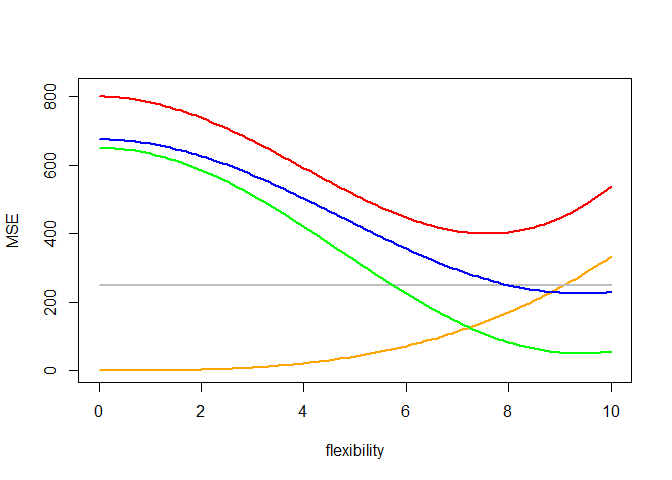
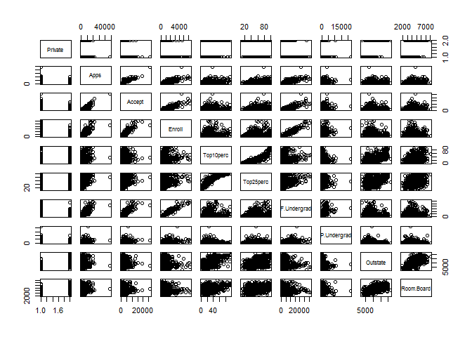
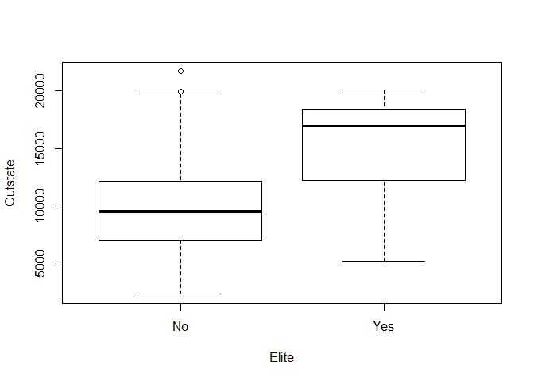
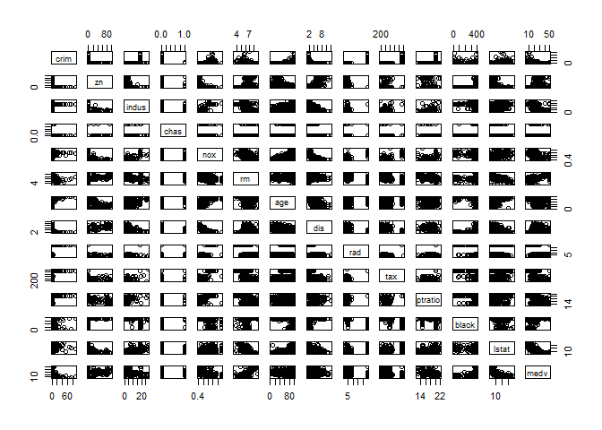
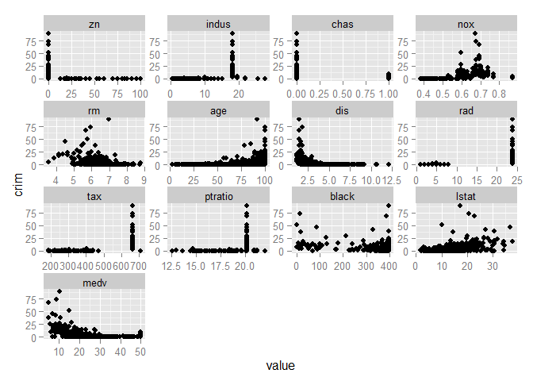
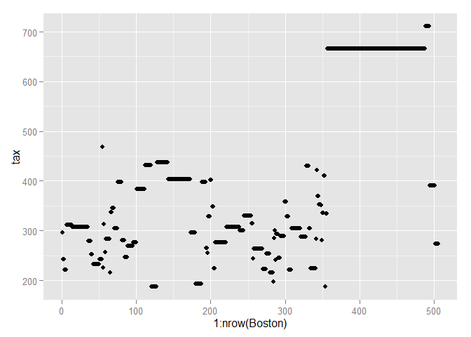
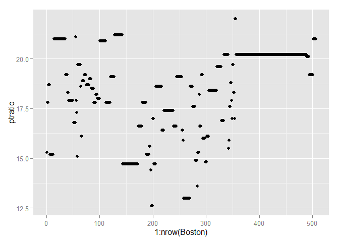

# Chapter 2: Statistical Learning
Solutions to Exercises  
November 19, 2015  

***
## CONCEPTUAL
***

>EXERCISE 1:

__Part a)__ 

flexible learning method would perform __better__ because sample size is large enough to fit more parameters and small number of predictors limits model variance

__Part b)__ 

flexible learning method would perform __worse__ because it would be more likely to overfit

__Part c)__ 

flexible learning method would perform __better__ because it is less restrictive on the shape of fit

__Part d)__ 

flexible learning method would perform __worse__ because it would be more likely to overfit

***

>EXERCISE 2:

__Part a)__ 

* regression
* inference
* n = 500 observations
* p = 3 variables
    * profit
    * number of employees
    * industry

__Part b)__ 

* classification
* prediction
* n = 20 observations
* p = 13 variables
    * price charged
    * marketing budget
    * competition price
    * _ten other variables_

__Part c)__ 

* regression
* inference
* n = 52 weekly observations
* p = 3 variables
    * change in the US market
    * change in the British market
    * change in the German market

***

>EXERCISE 3:

__Part a)__

* `red` = test error 
* `orange` = estimator variance 
* `green` = model bias 
* `gray` = irreducible error 
* `blue` = train error 

 

__Part b)__

* `variance` will increase with higher flexibility because changing data points will have more effect on the parameter estimates
* `bias` will decrease with higher flexibility because there are fewer assumptions made about the shape of the fit
* `test error` will have a U-shaped curve because it reflects the interaction between `variance` and `bias`
* `irreducible error` is the same regardless of model fit
* `train error` will always decrease with more model flexibility because an overfit model will produce lower MSE on the training data

***

>EXERCISE 4:

__Part a)__

* win/loss in basketball game
    * Response: team win or loss
    * Predictors: team strength/weakness, opponent strength/weakness, player injuries
    * Goal: both prediction to know win or loss and inference to understand what factors influence win/loss result 
* renew/non-renew insurance policy
    * Response: policyholder renew or cancel
    * Predictors: price change, customer elasticity, competitor price 
* type of particle
    * Response: particle type
    * Predictors: image, size, shape, time

__Part b)__

* fantasy points
    * Response: player fantasy points for next game
    * Predictors: past points, injuries, teammates, opponents
* salary for job posting
    * Response: salary
    * Predictors: position title, location, company/peer salaries
* insurance costs
    * Response: loss cost for policyholder
    * Predictors: experience losses, customer behavior stats

__Part c)__

* types of shoppers
* commodity groups
* personality styles

***

>EXERCISE 5:

Advantages of a very flexible model include better fit to data and fewer prior assumptions. Disadvantages are hard to interpret and prone to overfitting. 

A more flexible approach might be preferred is the underlying data is very complex (simple linear fit doesn't suffice) or if we mainly care about the result and not inference. A less flexible model is preferred is the underlying data has a simple shape or if inference is important.

***

>EXERCISE 6:

For parametric methods, we make an assumption about the shape of the underlying data, select a model form, and fit the data to our selected form. The advantage here is that we can incorporate any prior/expert knowledge and don't tend to have too many parameters that need to be fit. To the extent that our prior/expert assumptions are wrong, then that would be a disadvantage.

Non-parametric methods don't make explicit assumptions on the shape of the data. This can have the advantage of not needing to make an assumption on the form of the function and can more accurately fit a wider range of shapes for the underlying data. The key disadvantage is that they need a large number of observations to fit an accurate estimate.

***

>EXERCISE 7:

__Part a)__


```r
obs1 <- c(0, 3, 0)
obs2 <- c(2, 0, 0)
obs3 <- c(0, 1, 3)
obs4 <- c(0, 1, 2)
obs5 <- c(-1, 0, 1)
obs6 <- c(1, 1, 1)
obs0 <- c(0, 0, 0)

(dist1 <- sqrt(sum((obs1-obs0)^2)) )
```

```
## [1] 3
```

```r
(dist2 <- sqrt(sum((obs2-obs0)^2)) )
```

```
## [1] 2
```

```r
(dist3 <- sqrt(sum((obs3-obs0)^2)) )
```

```
## [1] 3.162278
```

```r
(dist4 <- sqrt(sum((obs4-obs0)^2)) )
```

```
## [1] 2.236068
```

```r
(dist5 <- sqrt(sum((obs5-obs0)^2)) )
```

```
## [1] 1.414214
```

```r
(dist6 <- sqrt(sum((obs6-obs0)^2)) )
```

```
## [1] 1.732051
```

__Part b)__

* closest 1 neighbor is obs5 
* prediction = __Green__

__Part c)__

* closest 3 neighbors are obs5, obs6, obs2 
* prediction = __Red__

__Part d)__

best value of K should be smaller to be able to capture more of the non-linear decision boundary

***
## APPLIED
***

>EXERCISE 8:

__Part a)__


```r
require(ISLR)
data(College)
str(College)
```

```
## 'data.frame':	777 obs. of  18 variables:
##  $ Private    : Factor w/ 2 levels "No","Yes": 2 2 2 2 2 2 2 2 2 2 ...
##  $ Apps       : num  1660 2186 1428 417 193 ...
##  $ Accept     : num  1232 1924 1097 349 146 ...
##  $ Enroll     : num  721 512 336 137 55 158 103 489 227 172 ...
##  $ Top10perc  : num  23 16 22 60 16 38 17 37 30 21 ...
##  $ Top25perc  : num  52 29 50 89 44 62 45 68 63 44 ...
##  $ F.Undergrad: num  2885 2683 1036 510 249 ...
##  $ P.Undergrad: num  537 1227 99 63 869 ...
##  $ Outstate   : num  7440 12280 11250 12960 7560 ...
##  $ Room.Board : num  3300 6450 3750 5450 4120 ...
##  $ Books      : num  450 750 400 450 800 500 500 450 300 660 ...
##  $ Personal   : num  2200 1500 1165 875 1500 ...
##  $ PhD        : num  70 29 53 92 76 67 90 89 79 40 ...
##  $ Terminal   : num  78 30 66 97 72 73 93 100 84 41 ...
##  $ S.F.Ratio  : num  18.1 12.2 12.9 7.7 11.9 9.4 11.5 13.7 11.3 11.5 ...
##  $ perc.alumni: num  12 16 30 37 2 11 26 37 23 15 ...
##  $ Expend     : num  7041 10527 8735 19016 10922 ...
##  $ Grad.Rate  : num  60 56 54 59 15 55 63 73 80 52 ...
```

__Part b)__


```r
# these steps were already taken on College data in the ISLR package
fix(College)  # pops up table in window
rownames(College) <- College[,1]  # set row names
College <- College[,-1]  # drop first col
```

__Part c)__


```r
# i.
summary(College)
```

```
##  Private        Apps           Accept          Enroll       Top10perc    
##  No :212   Min.   :   81   Min.   :   72   Min.   :  35   Min.   : 1.00  
##  Yes:565   1st Qu.:  776   1st Qu.:  604   1st Qu.: 242   1st Qu.:15.00  
##            Median : 1558   Median : 1110   Median : 434   Median :23.00  
##            Mean   : 3002   Mean   : 2019   Mean   : 780   Mean   :27.56  
##            3rd Qu.: 3624   3rd Qu.: 2424   3rd Qu.: 902   3rd Qu.:35.00  
##            Max.   :48094   Max.   :26330   Max.   :6392   Max.   :96.00  
##    Top25perc      F.Undergrad     P.Undergrad         Outstate    
##  Min.   :  9.0   Min.   :  139   Min.   :    1.0   Min.   : 2340  
##  1st Qu.: 41.0   1st Qu.:  992   1st Qu.:   95.0   1st Qu.: 7320  
##  Median : 54.0   Median : 1707   Median :  353.0   Median : 9990  
##  Mean   : 55.8   Mean   : 3700   Mean   :  855.3   Mean   :10441  
##  3rd Qu.: 69.0   3rd Qu.: 4005   3rd Qu.:  967.0   3rd Qu.:12925  
##  Max.   :100.0   Max.   :31643   Max.   :21836.0   Max.   :21700  
##    Room.Board       Books           Personal         PhD        
##  Min.   :1780   Min.   :  96.0   Min.   : 250   Min.   :  8.00  
##  1st Qu.:3597   1st Qu.: 470.0   1st Qu.: 850   1st Qu.: 62.00  
##  Median :4200   Median : 500.0   Median :1200   Median : 75.00  
##  Mean   :4358   Mean   : 549.4   Mean   :1341   Mean   : 72.66  
##  3rd Qu.:5050   3rd Qu.: 600.0   3rd Qu.:1700   3rd Qu.: 85.00  
##  Max.   :8124   Max.   :2340.0   Max.   :6800   Max.   :103.00  
##     Terminal       S.F.Ratio      perc.alumni        Expend     
##  Min.   : 24.0   Min.   : 2.50   Min.   : 0.00   Min.   : 3186  
##  1st Qu.: 71.0   1st Qu.:11.50   1st Qu.:13.00   1st Qu.: 6751  
##  Median : 82.0   Median :13.60   Median :21.00   Median : 8377  
##  Mean   : 79.7   Mean   :14.09   Mean   :22.74   Mean   : 9660  
##  3rd Qu.: 92.0   3rd Qu.:16.50   3rd Qu.:31.00   3rd Qu.:10830  
##  Max.   :100.0   Max.   :39.80   Max.   :64.00   Max.   :56233  
##    Grad.Rate     
##  Min.   : 10.00  
##  1st Qu.: 53.00  
##  Median : 65.00  
##  Mean   : 65.46  
##  3rd Qu.: 78.00  
##  Max.   :118.00
```

```r
# ii.
pairs(College[,1:10])
```

 

```r
# iii.
boxplot(Outstate~Private, data=College, xlab="Private", ylab="Outstate")
```

 

```r
# iv.
Elite <- rep("No", nrow(College))
Elite[College$Top10perc>50] <- "Yes"
College <- data.frame(College, Elite)
summary(College)  # 78 Elite
```

```
##  Private        Apps           Accept          Enroll       Top10perc    
##  No :212   Min.   :   81   Min.   :   72   Min.   :  35   Min.   : 1.00  
##  Yes:565   1st Qu.:  776   1st Qu.:  604   1st Qu.: 242   1st Qu.:15.00  
##            Median : 1558   Median : 1110   Median : 434   Median :23.00  
##            Mean   : 3002   Mean   : 2019   Mean   : 780   Mean   :27.56  
##            3rd Qu.: 3624   3rd Qu.: 2424   3rd Qu.: 902   3rd Qu.:35.00  
##            Max.   :48094   Max.   :26330   Max.   :6392   Max.   :96.00  
##    Top25perc      F.Undergrad     P.Undergrad         Outstate    
##  Min.   :  9.0   Min.   :  139   Min.   :    1.0   Min.   : 2340  
##  1st Qu.: 41.0   1st Qu.:  992   1st Qu.:   95.0   1st Qu.: 7320  
##  Median : 54.0   Median : 1707   Median :  353.0   Median : 9990  
##  Mean   : 55.8   Mean   : 3700   Mean   :  855.3   Mean   :10441  
##  3rd Qu.: 69.0   3rd Qu.: 4005   3rd Qu.:  967.0   3rd Qu.:12925  
##  Max.   :100.0   Max.   :31643   Max.   :21836.0   Max.   :21700  
##    Room.Board       Books           Personal         PhD        
##  Min.   :1780   Min.   :  96.0   Min.   : 250   Min.   :  8.00  
##  1st Qu.:3597   1st Qu.: 470.0   1st Qu.: 850   1st Qu.: 62.00  
##  Median :4200   Median : 500.0   Median :1200   Median : 75.00  
##  Mean   :4358   Mean   : 549.4   Mean   :1341   Mean   : 72.66  
##  3rd Qu.:5050   3rd Qu.: 600.0   3rd Qu.:1700   3rd Qu.: 85.00  
##  Max.   :8124   Max.   :2340.0   Max.   :6800   Max.   :103.00  
##     Terminal       S.F.Ratio      perc.alumni        Expend     
##  Min.   : 24.0   Min.   : 2.50   Min.   : 0.00   Min.   : 3186  
##  1st Qu.: 71.0   1st Qu.:11.50   1st Qu.:13.00   1st Qu.: 6751  
##  Median : 82.0   Median :13.60   Median :21.00   Median : 8377  
##  Mean   : 79.7   Mean   :14.09   Mean   :22.74   Mean   : 9660  
##  3rd Qu.: 92.0   3rd Qu.:16.50   3rd Qu.:31.00   3rd Qu.:10830  
##  Max.   :100.0   Max.   :39.80   Max.   :64.00   Max.   :56233  
##    Grad.Rate      Elite    
##  Min.   : 10.00   No :699  
##  1st Qu.: 53.00   Yes: 78  
##  Median : 65.00            
##  Mean   : 65.46            
##  3rd Qu.: 78.00            
##  Max.   :118.00
```

```r
boxplot(Outstate~Elite, data=College, xlab="Elite", ylab="Outstate")
```

 

```r
# v. 
par(mfrow=c(2,2))
hist(College$Apps, breaks=50, xlim=c(0,25000), main="Apps")
hist(College$Enroll, breaks=25, main="Enroll")
hist(College$Expend, breaks=25, main="Expend")
hist(College$Outstate, main="Outstate")
```

 

```r
# vi.
```

***

>EXERCISE 9:

__Part a)__


```r
require(ISLR)
data(Auto)
str(Auto)
```

```
## 'data.frame':	392 obs. of  9 variables:
##  $ mpg         : num  18 15 18 16 17 15 14 14 14 15 ...
##  $ cylinders   : num  8 8 8 8 8 8 8 8 8 8 ...
##  $ displacement: num  307 350 318 304 302 429 454 440 455 390 ...
##  $ horsepower  : num  130 165 150 150 140 198 220 215 225 190 ...
##  $ weight      : num  3504 3693 3436 3433 3449 ...
##  $ acceleration: num  12 11.5 11 12 10.5 10 9 8.5 10 8.5 ...
##  $ year        : num  70 70 70 70 70 70 70 70 70 70 ...
##  $ origin      : num  1 1 1 1 1 1 1 1 1 1 ...
##  $ name        : Factor w/ 304 levels "amc ambassador brougham",..: 49 36 231 14 161 141 54 223 241 2 ...
```

* quantitative: _mpg, cylinders (can treat as qual too), displacement, horsepower, weight, acceleration, year_
* qualitative: _origin, name_

__Part b)__


```r
range(Auto$mpg)
```

```
## [1]  9.0 46.6
```

```r
range(Auto$cylinders)
```

```
## [1] 3 8
```

```r
range(Auto$displacement)
```

```
## [1]  68 455
```

```r
range(Auto$horsepower)
```

```
## [1]  46 230
```

```r
range(Auto$weight)
```

```
## [1] 1613 5140
```

```r
range(Auto$acceleration)
```

```
## [1]  8.0 24.8
```

```r
range(Auto$year)
```

```
## [1] 70 82
```

__Part c)__


```r
sapply(Auto[,1:7], mean)
```

```
##          mpg    cylinders displacement   horsepower       weight 
##    23.445918     5.471939   194.411990   104.469388  2977.584184 
## acceleration         year 
##    15.541327    75.979592
```

```r
sapply(Auto[,1:7], sd)
```

```
##          mpg    cylinders displacement   horsepower       weight 
##     7.805007     1.705783   104.644004    38.491160   849.402560 
## acceleration         year 
##     2.758864     3.683737
```

__Part d)__


```r
# create temp matrix for numeric columns
tmp <- Auto[,-(8:9)]   # drop origin, name
tmp <- tmp[-(10:85),]  # drop rows
sapply(tmp, range)
```

```
##       mpg cylinders displacement horsepower weight acceleration year
## [1,] 11.0         3           68         46   1649          8.5   70
## [2,] 46.6         8          455        230   4997         24.8   82
```

```r
sapply(tmp, mean)
```

```
##          mpg    cylinders displacement   horsepower       weight 
##    24.404430     5.373418   187.240506   100.721519  2935.971519 
## acceleration         year 
##    15.726899    77.145570
```

```r
sapply(tmp, sd)
```

```
##          mpg    cylinders displacement   horsepower       weight 
##     7.867283     1.654179    99.678367    35.708853   811.300208 
## acceleration         year 
##     2.693721     3.106217
```

__Part e)__


```r
pairs(Auto[,1:7])
```

 

* `mpg` is negatively correlated with `cylinders`, `displacement`, `horsepower`, and `weight`
* `horsepower` is negatively correlated with `weight`
* `mpg` mostly increases for newer model years

__Part f)__

yes, the plots show that there are relationships between `mpg` and other variables in the data set

***

>EXERCISE 10:

__Part a)__


```r
require(ISLR)
require(MASS)
data(Boston)
str(Boston)  # 506 rows, 14 cols
```

```
## 'data.frame':	506 obs. of  14 variables:
##  $ crim   : num  0.00632 0.02731 0.02729 0.03237 0.06905 ...
##  $ zn     : num  18 0 0 0 0 0 12.5 12.5 12.5 12.5 ...
##  $ indus  : num  2.31 7.07 7.07 2.18 2.18 2.18 7.87 7.87 7.87 7.87 ...
##  $ chas   : int  0 0 0 0 0 0 0 0 0 0 ...
##  $ nox    : num  0.538 0.469 0.469 0.458 0.458 0.458 0.524 0.524 0.524 0.524 ...
##  $ rm     : num  6.58 6.42 7.18 7 7.15 ...
##  $ age    : num  65.2 78.9 61.1 45.8 54.2 58.7 66.6 96.1 100 85.9 ...
##  $ dis    : num  4.09 4.97 4.97 6.06 6.06 ...
##  $ rad    : int  1 2 2 3 3 3 5 5 5 5 ...
##  $ tax    : num  296 242 242 222 222 222 311 311 311 311 ...
##  $ ptratio: num  15.3 17.8 17.8 18.7 18.7 18.7 15.2 15.2 15.2 15.2 ...
##  $ black  : num  397 397 393 395 397 ...
##  $ lstat  : num  4.98 9.14 4.03 2.94 5.33 ...
##  $ medv   : num  24 21.6 34.7 33.4 36.2 28.7 22.9 27.1 16.5 18.9 ...
```

* data set includes 506 rows and 14 columns
    * rows represent observations for each town 
    * columns represent features

__Part b)__


```r
pairs(Boston)
```

 

relationship between crime rate per capita and other variables don't seem to be linear

__Part c)__


```r
require(ggplot2)
require(reshape2)

# plot each feature against crim rate
bosmelt <- melt(Boston, id="crim")
ggplot(bosmelt, aes(x=value, y=crim)) +
  facet_wrap(~variable, scales="free") + 
  geom_point()
```

 

```r
(corrmatrix <- cor(Boston, use="complete.obs")[1,])
```

```
##        crim          zn       indus        chas         nox          rm 
##  1.00000000 -0.20046922  0.40658341 -0.05589158  0.42097171 -0.21924670 
##         age         dis         rad         tax     ptratio       black 
##  0.35273425 -0.37967009  0.62550515  0.58276431  0.28994558 -0.38506394 
##       lstat        medv 
##  0.45562148 -0.38830461
```

```r
corrmatrix[corrmatrix > 0.5 | corrmatrix < -0.5][-1]
```

```
##       rad       tax 
## 0.6255051 0.5827643
```

* some correlations with each variable, except chas
* crim rates seem to spike within certain zones
    * when `rad` is > 20
    * when `tax` is between 600 and 700
    * when `zn` is close to 0
    * etc.
* negative correlations with `dis`, `medv` and maybe `black`

__Part d)__


```r
require(ggplot2)
g <- ggplot(Boston, aes(x=1:nrow(Boston), y=crim))
g + geom_point()
```

 

```r
g <- ggplot(Boston, aes(x=1:nrow(Boston), y=tax))
g + geom_point()
```

 

```r
g <- ggplot(Boston, aes(x=1:nrow(Boston), y=ptratio))
g + geom_point()
```

 

* definitely outliers for `crim` and `tax`
* no clear outlier for `ptratio`

__Part e)__


```r
table(Boston$chas)  # 35 towns
```

```
## 
##   0   1 
## 471  35
```

__Part f)__


```r
median(Boston$ptratio)  # 19.05
```

```
## [1] 19.05
```


__Part g)__


```r
# there are two towns with lowest medv value of 5
(seltown <- Boston[Boston$medv == min(Boston$medv),])
```

```
##        crim zn indus chas   nox    rm age    dis rad tax ptratio  black
## 399 38.3518  0  18.1    0 0.693 5.453 100 1.4896  24 666    20.2 396.90
## 406 67.9208  0  18.1    0 0.693 5.683 100 1.4254  24 666    20.2 384.97
##     lstat medv
## 399 30.59    5
## 406 22.98    5
```

```r
# overall quartiles and range of predictors
sapply(Boston, quantile)
```

```
##           crim    zn indus chas   nox     rm     age       dis rad tax
## 0%    0.006320   0.0  0.46    0 0.385 3.5610   2.900  1.129600   1 187
## 25%   0.082045   0.0  5.19    0 0.449 5.8855  45.025  2.100175   4 279
## 50%   0.256510   0.0  9.69    0 0.538 6.2085  77.500  3.207450   5 330
## 75%   3.677083  12.5 18.10    0 0.624 6.6235  94.075  5.188425  24 666
## 100% 88.976200 100.0 27.74    1 0.871 8.7800 100.000 12.126500  24 711
##      ptratio    black  lstat   medv
## 0%     12.60   0.3200  1.730  5.000
## 25%    17.40 375.3775  6.950 17.025
## 50%    19.05 391.4400 11.360 21.200
## 75%    20.20 396.2250 16.955 25.000
## 100%   22.00 396.9000 37.970 50.000
```

* `age`, `rad` at max
* `crim`, `indus`, `nox`, `tax`, `ptratio`, `lstat` at or above 75th percentile
* low for `zn`, `rm`, `dis`

__Part h)__


```r
# count of towns
nrow(Boston[Boston$rm > 7,])  # 64 with > 7 rooms
```

```
## [1] 64
```

```r
nrow(Boston[Boston$rm > 8,])  # 13 with > 8 rooms
```

```
## [1] 13
```

```r
# row 1: mean for towns with > 8 rooms per dwelling
# row 2: median for all towns
rbind(sapply(Boston[Boston$rm > 8,], mean), sapply(Boston, median))
```

```
##           crim       zn    indus      chas       nox       rm      age
## [1,] 0.7187954 13.61538 7.078462 0.1538462 0.5392385 8.348538 71.53846
## [2,] 0.2565100  0.00000 9.690000 0.0000000 0.5380000 6.208500 77.50000
##           dis      rad      tax  ptratio    black lstat medv
## [1,] 3.430192 7.461538 325.0769 16.36154 385.2108  4.31 44.2
## [2,] 3.207450 5.000000 330.0000 19.05000 391.4400 11.36 21.2
```

* crim rates are higher (almost 3X)
* higher proportion of 25K sq ft lots
* much lower `lstat` value
* higher `medv` value
