# Chapter 3: Linear Regression
Solutions to Exercises  
January 7, 2016  

***
## CONCEPTUAL
***

>EXERCISE 1:

`TV` and `radio` are related to `sales` but no evidence that `newspaper` is associated with `sales` in the presence of other predictors. 

***

>EXERCISE 2:

KNN regression averages the closest observations to estimate prediction, KNN classifier assigns classification group based on majority of closest observations.

***

>EXERCISE 3:

__Part a)__

Resulting fit formula is:

`Y = 50 + 20*GPA + 0.07*IQ + 35*Gender + 0.01*GPA:IQ - 10*GPA:Gender`

Point iii is correct: For GPA above 35/10=3.5, males will earn more.

__Part b)__

Salary

= 50 + 20x4.0 + 0.07x110 + 35x1 + 0.01x4.0x110 - 10x4.0x1

= 137.1 thousand dollars

__Part c)__

FALSE: IQ scale is larger than other predictors (~100 versus 1-4 for GPA and 0-1 for gender) so even if all predictors have the same impact on salary, coefficients will be smaller for IQ predictors.

***

>EXERCISE 4:

__Part a)__

Having more predictors generally means better (lower) RSS on training data

__Part b)__

If the additional predictors lead to overfitting, the testing RSS could be worse (higher) for the cubic regression fit

__Part c)__

The cubic regression fit should produce a better RSS on the training set because it can adjust for the non-linearity

__Part d)__

Similar to training RSS, the cubic regression fit should produce a better RSS on the testing set because it can adjust for the non-linearity

***

>EXERCISE 5:

$$ \hat{y}_{i} = x_{i} \times \frac{\sum_{i'=1}^{n}\left ( x_{i'} y_{i'} \right )}{\sum_{j=1}^{n} x_{j}^{2}} $$

$$ \hat{y}_{i} = \sum_{i'=1}^{n} \frac{\left ( x_{i'} y_{i'} \right ) \times x_{i}}{\sum_{j=1}^{n} x_{j}^{2}} $$

$$ \hat{y}_{i} = \sum_{i'=1}^{n} \left ( \frac{ x_{i} x_{i'} } { \sum_{j=1}^{n} x_{j}^{2} } \times y_{i'} \right ) $$

$$ a_{i'} = \frac{ x_{i} x_{i'} } { \sum_{j=1}^{n} x_{j}^{2} } $$

***

>EXERCISE 6:

Using equation (3.4) on page 62, when $x_{i}=\bar{x}$, then $\hat{\beta_{1}}=0$ and $\hat{\beta_{0}}=\bar{y}$ and the equation for $\hat{y_{i}}$ evaluates to equal $\bar{y}$

***

>EXERCISE 7:

[*... will come back to this. maybe.*]

__Given:__

For $\bar{x}=\bar{y}=0$,

$$ R^{2} = \frac{TSS - RSS}{TSS} = 1- \frac{RSS}{TSS} $$

$$ TSS = \sum_{i=1}^{n} \left ( y_{i}-\bar{y}\right )^{2} = \sum_{i=1}^{n} y_{i}^{2} $$

$$ RSS = \sum_{i=1}^{n} \left ( y_{i}-\hat{y_{i}}\right )^{2} = \sum_{i=1}^{n} \left ( y_{i}-\left ( \hat{\beta_{0}} + \hat{\beta_{1}}x_{i} \right )\right )^{2} = \sum_{i=1}^{n} \left ( y_{i}-\left ( \frac{\sum_{j=1}^{n} x_{j}y_{j} }{\sum_{k=1}^{n} x_{k}^{2}} \right ) x_{i} \right )^{2} $$

$$ Cor \left( X, Y\right) = \frac{\sum_{i=1}^{n} x_{i} y_{i}}{\sqrt{\sum_{j=1}^{n}x_{j}^{2} \times \sum_{k=1}^{n}y_{k}^{2}} } $$

__Prove:__

$$ R^{2} = \left[ Cor \left( X, Y\right)\right]^{2} $$

***
## APPLIED
***

>EXERCISE 8:

__Part a)__


```r
require(ISLR)
data(Auto)
fit.lm <- lm(mpg ~ horsepower, data=Auto)
summary(fit.lm)
```

```
## 
## Call:
## lm(formula = mpg ~ horsepower, data = Auto)
## 
## Residuals:
##      Min       1Q   Median       3Q      Max 
## -13.5710  -3.2592  -0.3435   2.7630  16.9240 
## 
## Coefficients:
##              Estimate Std. Error t value Pr(>|t|)    
## (Intercept) 39.935861   0.717499   55.66   <2e-16 ***
## horsepower  -0.157845   0.006446  -24.49   <2e-16 ***
## ---
## Signif. codes:  0 '***' 0.001 '**' 0.01 '*' 0.05 '.' 0.1 ' ' 1
## 
## Residual standard error: 4.906 on 390 degrees of freedom
## Multiple R-squared:  0.6059,	Adjusted R-squared:  0.6049 
## F-statistic: 599.7 on 1 and 390 DF,  p-value: < 2.2e-16
```

```r
# i. Yes, there is a relationship between predictor and response

# ii. p-value is close to 0: relationship is strong

# iii. Coefficient is negative: relationship is negative

# iv. 
new <- data.frame(horsepower = 98)
predict(fit.lm, new)  # predicted mpg
```

```
##        1 
## 24.46708
```

```r
predict(fit.lm, new, interval = "confidence")  # conf interval
```

```
##        fit      lwr      upr
## 1 24.46708 23.97308 24.96108
```

```r
predict(fit.lm, new, interval = "prediction")  # pred interval
```

```
##        fit     lwr      upr
## 1 24.46708 14.8094 34.12476
```

__Part b)__


```r
plot(Auto$horsepower, Auto$mpg)
abline(fit.lm, col="red")
```

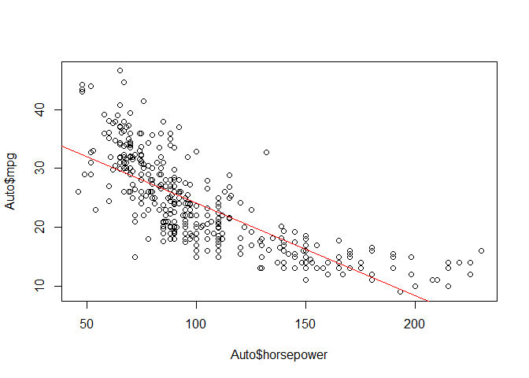 

__Part c)__


```r
par(mfrow=c(2,2))
plot(fit.lm)
```

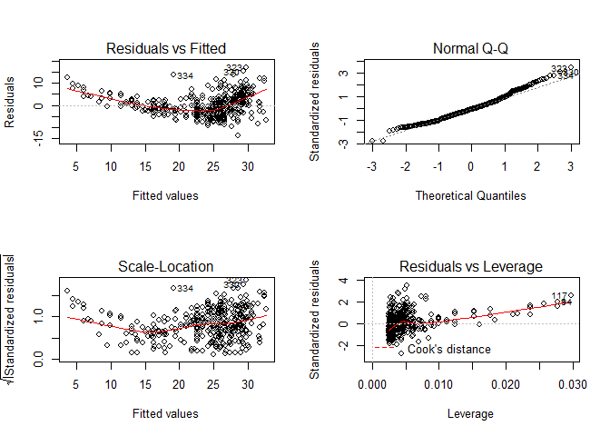 

* residuals vs fitted plot shows that the relationship is non-linear

***

>EXERCISE 9:

__Part a)__


```r
require(ISLR)
data(Auto)
pairs(Auto)
```

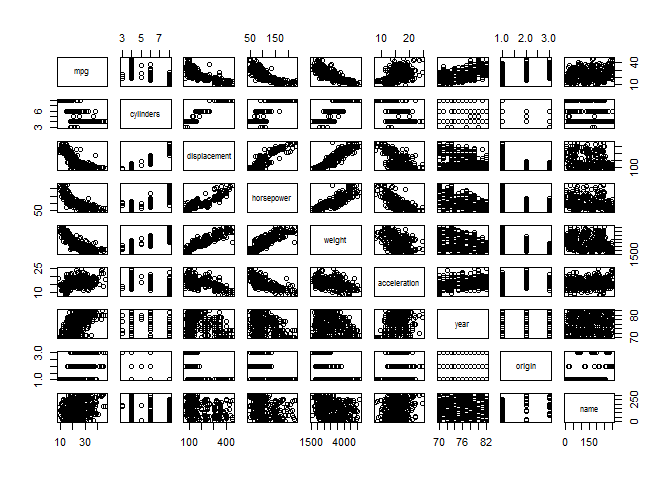 

__Part b)__


```r
cor(subset(Auto, select=-name))
```

```
##                     mpg  cylinders displacement horsepower     weight
## mpg           1.0000000 -0.7776175   -0.8051269 -0.7784268 -0.8322442
## cylinders    -0.7776175  1.0000000    0.9508233  0.8429834  0.8975273
## displacement -0.8051269  0.9508233    1.0000000  0.8972570  0.9329944
## horsepower   -0.7784268  0.8429834    0.8972570  1.0000000  0.8645377
## weight       -0.8322442  0.8975273    0.9329944  0.8645377  1.0000000
## acceleration  0.4233285 -0.5046834   -0.5438005 -0.6891955 -0.4168392
## year          0.5805410 -0.3456474   -0.3698552 -0.4163615 -0.3091199
## origin        0.5652088 -0.5689316   -0.6145351 -0.4551715 -0.5850054
##              acceleration       year     origin
## mpg             0.4233285  0.5805410  0.5652088
## cylinders      -0.5046834 -0.3456474 -0.5689316
## displacement   -0.5438005 -0.3698552 -0.6145351
## horsepower     -0.6891955 -0.4163615 -0.4551715
## weight         -0.4168392 -0.3091199 -0.5850054
## acceleration    1.0000000  0.2903161  0.2127458
## year            0.2903161  1.0000000  0.1815277
## origin          0.2127458  0.1815277  1.0000000
```

__Part c)__


```r
fit.lm <- lm(mpg~.-name, data=Auto)
summary(fit.lm)
```

```
## 
## Call:
## lm(formula = mpg ~ . - name, data = Auto)
## 
## Residuals:
##     Min      1Q  Median      3Q     Max 
## -9.5903 -2.1565 -0.1169  1.8690 13.0604 
## 
## Coefficients:
##                Estimate Std. Error t value Pr(>|t|)    
## (Intercept)  -17.218435   4.644294  -3.707  0.00024 ***
## cylinders     -0.493376   0.323282  -1.526  0.12780    
## displacement   0.019896   0.007515   2.647  0.00844 ** 
## horsepower    -0.016951   0.013787  -1.230  0.21963    
## weight        -0.006474   0.000652  -9.929  < 2e-16 ***
## acceleration   0.080576   0.098845   0.815  0.41548    
## year           0.750773   0.050973  14.729  < 2e-16 ***
## origin         1.426141   0.278136   5.127 4.67e-07 ***
## ---
## Signif. codes:  0 '***' 0.001 '**' 0.01 '*' 0.05 '.' 0.1 ' ' 1
## 
## Residual standard error: 3.328 on 384 degrees of freedom
## Multiple R-squared:  0.8215,	Adjusted R-squared:  0.8182 
## F-statistic: 252.4 on 7 and 384 DF,  p-value: < 2.2e-16
```

* There is a relationship between predictors and response
* `weight`, `year`, `origin` and `displacement` have statistically significant relationships
* 0.75 coefficient for `year` suggests that later model year cars have better (higher) `mpg`

__Part d)__


```r
par(mfrow=c(2,2))
plot(fit.lm)
```

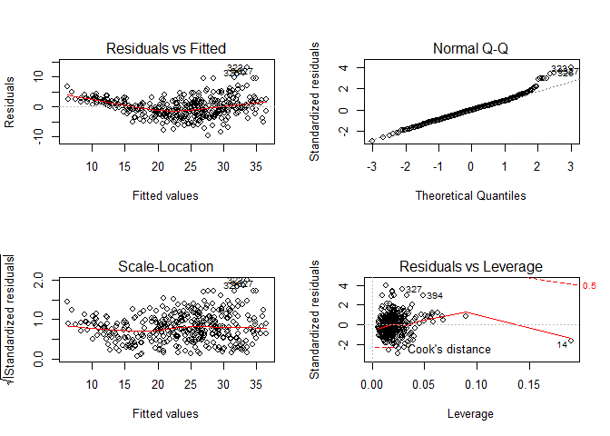 

* evidence of non-linearity
* observation 14 has high leverage

__Part e)__


```r
# try 3 interactions
fit.lm0 <- lm(mpg~displacement+weight+year+origin, data=Auto)
fit.lm1 <- lm(mpg~displacement+weight+year*origin, data=Auto)
fit.lm2 <- lm(mpg~displacement+origin+year*weight, data=Auto)
fit.lm3 <- lm(mpg~year+origin+displacement*weight, data=Auto)
summary(fit.lm0)
```

```
## 
## Call:
## lm(formula = mpg ~ displacement + weight + year + origin, data = Auto)
## 
## Residuals:
##     Min      1Q  Median      3Q     Max 
## -9.8102 -2.1129 -0.0388  1.7725 13.2085 
## 
## Coefficients:
##                Estimate Std. Error t value Pr(>|t|)    
## (Intercept)  -1.861e+01  4.028e+00  -4.620 5.25e-06 ***
## displacement  5.588e-03  4.768e-03   1.172    0.242    
## weight       -6.575e-03  5.571e-04 -11.802  < 2e-16 ***
## year          7.714e-01  4.981e-02  15.486  < 2e-16 ***
## origin        1.226e+00  2.670e-01   4.593 5.92e-06 ***
## ---
## Signif. codes:  0 '***' 0.001 '**' 0.01 '*' 0.05 '.' 0.1 ' ' 1
## 
## Residual standard error: 3.346 on 387 degrees of freedom
## Multiple R-squared:  0.8181,	Adjusted R-squared:  0.8162 
## F-statistic: 435.1 on 4 and 387 DF,  p-value: < 2.2e-16
```

```r
summary(fit.lm1)
```

```
## 
## Call:
## lm(formula = mpg ~ displacement + weight + year * origin, data = Auto)
## 
## Residuals:
##     Min      1Q  Median      3Q     Max 
## -8.7541 -1.8722 -0.0936  1.6900 12.4650 
## 
## Coefficients:
##                Estimate Std. Error t value Pr(>|t|)    
## (Intercept)   7.927e+00  8.873e+00   0.893 0.372229    
## displacement  1.551e-03  4.859e-03   0.319 0.749735    
## weight       -6.394e-03  5.526e-04 -11.571  < 2e-16 ***
## year          4.313e-01  1.130e-01   3.818 0.000157 ***
## origin       -1.449e+01  4.707e+00  -3.079 0.002225 ** 
## year:origin   2.023e-01  6.047e-02   3.345 0.000904 ***
## ---
## Signif. codes:  0 '***' 0.001 '**' 0.01 '*' 0.05 '.' 0.1 ' ' 1
## 
## Residual standard error: 3.303 on 386 degrees of freedom
## Multiple R-squared:  0.8232,	Adjusted R-squared:  0.8209 
## F-statistic: 359.5 on 5 and 386 DF,  p-value: < 2.2e-16
```

```r
summary(fit.lm2)
```

```
## 
## Call:
## lm(formula = mpg ~ displacement + origin + year * weight, data = Auto)
## 
## Residuals:
##     Min      1Q  Median      3Q     Max 
## -8.9402 -1.8736 -0.0966  1.5924 12.2125 
## 
## Coefficients:
##                Estimate Std. Error t value Pr(>|t|)    
## (Intercept)  -1.076e+02  1.290e+01  -8.339 1.34e-15 ***
## displacement -4.020e-04  4.558e-03  -0.088 0.929767    
## origin        9.116e-01  2.547e-01   3.579 0.000388 ***
## year          1.962e+00  1.716e-01  11.436  < 2e-16 ***
## weight        2.605e-02  4.552e-03   5.722 2.12e-08 ***
## year:weight  -4.305e-04  5.967e-05  -7.214 2.89e-12 ***
## ---
## Signif. codes:  0 '***' 0.001 '**' 0.01 '*' 0.05 '.' 0.1 ' ' 1
## 
## Residual standard error: 3.145 on 386 degrees of freedom
## Multiple R-squared:  0.8397,	Adjusted R-squared:  0.8376 
## F-statistic: 404.4 on 5 and 386 DF,  p-value: < 2.2e-16
```

```r
summary(fit.lm3)
```

```
## 
## Call:
## lm(formula = mpg ~ year + origin + displacement * weight, data = Auto)
## 
## Residuals:
##      Min       1Q   Median       3Q      Max 
## -10.6119  -1.7290  -0.0115   1.5609  12.5584 
## 
## Coefficients:
##                       Estimate Std. Error t value Pr(>|t|)    
## (Intercept)         -8.007e+00  3.798e+00  -2.108   0.0357 *  
## year                 8.194e-01  4.518e-02  18.136  < 2e-16 ***
## origin               3.567e-01  2.574e-01   1.386   0.1666    
## displacement        -7.148e-02  9.176e-03  -7.790 6.27e-14 ***
## weight              -1.054e-02  6.530e-04 -16.146  < 2e-16 ***
## displacement:weight  2.104e-05  2.214e-06   9.506  < 2e-16 ***
## ---
## Signif. codes:  0 '***' 0.001 '**' 0.01 '*' 0.05 '.' 0.1 ' ' 1
## 
## Residual standard error: 3.016 on 386 degrees of freedom
## Multiple R-squared:  0.8526,	Adjusted R-squared:  0.8507 
## F-statistic: 446.5 on 5 and 386 DF,  p-value: < 2.2e-16
```

All 3 interactions tested seem to have statistically significant effects.

__Part f)__


```r
# try 3 predictor transformations
fit.lm4 <- lm(mpg~poly(displacement,3)+weight+year+origin, data=Auto)
fit.lm5 <- lm(mpg~displacement+I(log(weight))+year+origin, data=Auto)
fit.lm6 <- lm(mpg~displacement+I(weight^2)+year+origin, data=Auto)
summary(fit.lm4)
```

```
## 
## Call:
## lm(formula = mpg ~ poly(displacement, 3) + weight + year + origin, 
##     data = Auto)
## 
## Residuals:
##      Min       1Q   Median       3Q      Max 
## -11.8131  -1.8012   0.0788   1.5566  12.3181 
## 
## Coefficients:
##                          Estimate Std. Error t value Pr(>|t|)    
## (Intercept)            -2.342e+01  3.802e+00  -6.160 1.84e-09 ***
## poly(displacement, 3)1 -1.701e+01  9.820e+00  -1.732   0.0840 .  
## poly(displacement, 3)2  2.840e+01  3.610e+00   7.866 3.74e-14 ***
## poly(displacement, 3)3 -7.996e+00  3.164e+00  -2.527   0.0119 *  
## weight                 -5.285e-03  5.419e-04  -9.753  < 2e-16 ***
## year                    8.189e-01  4.660e-02  17.572  < 2e-16 ***
## origin                  2.422e-01  2.761e-01   0.877   0.3810    
## ---
## Signif. codes:  0 '***' 0.001 '**' 0.01 '*' 0.05 '.' 0.1 ' ' 1
## 
## Residual standard error: 3.102 on 385 degrees of freedom
## Multiple R-squared:  0.8445,	Adjusted R-squared:  0.842 
## F-statistic: 348.4 on 6 and 385 DF,  p-value: < 2.2e-16
```

```r
summary(fit.lm5)
```

```
## 
## Call:
## lm(formula = mpg ~ displacement + I(log(weight)) + year + origin, 
##     data = Auto)
## 
## Residuals:
##     Min      1Q  Median      3Q     Max 
## -9.7136 -1.9214  0.0447  1.5790 12.9864 
## 
## Coefficients:
##                  Estimate Std. Error t value Pr(>|t|)    
## (Intercept)    131.274483  11.082986  11.845  < 2e-16 ***
## displacement     0.007711   0.004052   1.903 0.057810 .  
## I(log(weight)) -21.584745   1.451851 -14.867  < 2e-16 ***
## year             0.804835   0.046532  17.296  < 2e-16 ***
## origin           0.836143   0.250485   3.338 0.000925 ***
## ---
## Signif. codes:  0 '***' 0.001 '**' 0.01 '*' 0.05 '.' 0.1 ' ' 1
## 
## Residual standard error: 3.113 on 387 degrees of freedom
## Multiple R-squared:  0.8425,	Adjusted R-squared:  0.8409 
## F-statistic: 517.7 on 4 and 387 DF,  p-value: < 2.2e-16
```

```r
summary(fit.lm6)
```

```
## 
## Call:
## lm(formula = mpg ~ displacement + I(weight^2) + year + origin, 
##     data = Auto)
## 
## Residuals:
##      Min       1Q   Median       3Q      Max 
## -10.0988  -2.2549  -0.1057   1.8704  13.4702 
## 
## Coefficients:
##                Estimate Std. Error t value Pr(>|t|)    
## (Intercept)  -2.609e+01  4.349e+00  -5.999 4.56e-09 ***
## displacement -9.114e-03  5.118e-03  -1.781   0.0757 .  
## I(weight^2)  -7.068e-07  9.075e-08  -7.789 6.28e-14 ***
## year          7.336e-01  5.380e-02  13.635  < 2e-16 ***
## origin        1.488e+00  2.900e-01   5.132 4.56e-07 ***
## ---
## Signif. codes:  0 '***' 0.001 '**' 0.01 '*' 0.05 '.' 0.1 ' ' 1
## 
## Residual standard error: 3.628 on 387 degrees of freedom
## Multiple R-squared:  0.7861,	Adjusted R-squared:  0.7839 
## F-statistic: 355.7 on 4 and 387 DF,  p-value: < 2.2e-16
```

* `displacement`^2 has a larger effect than other `displacement` polynomials

***

>EXERCISE 10:

__Part a)__


```r
require(ISLR)
data(Carseats)
fit.lm <- lm(Sales ~ Price + Urban + US, data=Carseats)
summary(fit.lm)
```

```
## 
## Call:
## lm(formula = Sales ~ Price + Urban + US, data = Carseats)
## 
## Residuals:
##     Min      1Q  Median      3Q     Max 
## -6.9206 -1.6220 -0.0564  1.5786  7.0581 
## 
## Coefficients:
##              Estimate Std. Error t value Pr(>|t|)    
## (Intercept) 13.043469   0.651012  20.036  < 2e-16 ***
## Price       -0.054459   0.005242 -10.389  < 2e-16 ***
## UrbanYes    -0.021916   0.271650  -0.081    0.936    
## USYes        1.200573   0.259042   4.635 4.86e-06 ***
## ---
## Signif. codes:  0 '***' 0.001 '**' 0.01 '*' 0.05 '.' 0.1 ' ' 1
## 
## Residual standard error: 2.472 on 396 degrees of freedom
## Multiple R-squared:  0.2393,	Adjusted R-squared:  0.2335 
## F-statistic: 41.52 on 3 and 396 DF,  p-value: < 2.2e-16
```

__Part b)__

Sales: sales in thousands at each location
Price: price charged for car seats at each location
Urban: No/Yes by location
US: No/Yes by location

Coefficients for

* Price (-0.054459): Sales drop by 54 for each dollar increase in Price - statistically significant
* UrbanYes (-0.021916): Sales are 22 lower for Urban locations - not statistically significant
* USYes (1.200573): Sales are 1,201 higher in the US locations - statistically significant

__Part c)__

Sales = 13.043 - 0.054 x Price - 0.022 x UrbanYes + 1.201 x USYes

__Part d)__

Can reject null hypothesis for Price and USYes (coefficients have low p-values)

__Part e)__


```r
fit.lm1 <- lm(Sales ~ Price + US, data=Carseats)
summary(fit.lm1)
```

```
## 
## Call:
## lm(formula = Sales ~ Price + US, data = Carseats)
## 
## Residuals:
##     Min      1Q  Median      3Q     Max 
## -6.9269 -1.6286 -0.0574  1.5766  7.0515 
## 
## Coefficients:
##             Estimate Std. Error t value Pr(>|t|)    
## (Intercept) 13.03079    0.63098  20.652  < 2e-16 ***
## Price       -0.05448    0.00523 -10.416  < 2e-16 ***
## USYes        1.19964    0.25846   4.641 4.71e-06 ***
## ---
## Signif. codes:  0 '***' 0.001 '**' 0.01 '*' 0.05 '.' 0.1 ' ' 1
## 
## Residual standard error: 2.469 on 397 degrees of freedom
## Multiple R-squared:  0.2393,	Adjusted R-squared:  0.2354 
## F-statistic: 62.43 on 2 and 397 DF,  p-value: < 2.2e-16
```

__Part f)__

* `fit.lm` (Price, Urban, US):
    * RSE = 2.472
    * R^2 = 0.2393
* `fit.lm1` (Price, US):
    * RSE = 2.469
    * R^2 = 0.2393
    
`fit.lm1` has a slightly better (lower) RSE value and one less predictor variable.

__Part g)__


```r
confint(fit.lm1)
```

```
##                   2.5 %      97.5 %
## (Intercept) 11.79032020 14.27126531
## Price       -0.06475984 -0.04419543
## USYes        0.69151957  1.70776632
```

__Part h)__


```r
par(mfrow=c(2,2))
# residuals v fitted plot doesn't show strong outliers
plot(fit.lm1)  
```

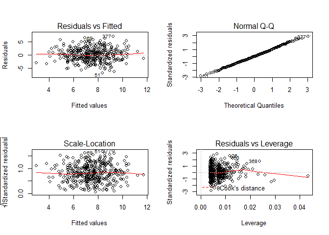 

```r
par(mfrow=c(1,1))
# studentized residuals within -3 to 3 range
plot(predict(fit.lm1), rstudent(fit.lm1))
# load car packages
require(car)
```

```
## Loading required package: car
```

```
## Warning: package 'car' was built under R version 3.2.2
```

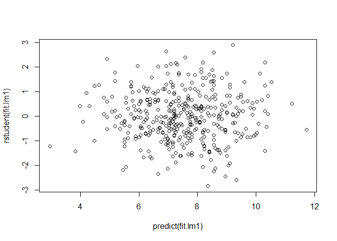 

```r
# no evidence of outliers
qqPlot(fit.lm1, main="QQ Plot")  # studentized resid
```

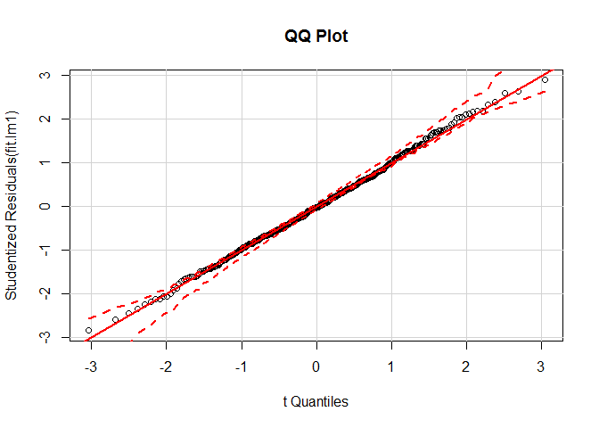 

```r
leveragePlots(fit.lm1)  # leverage plots
```

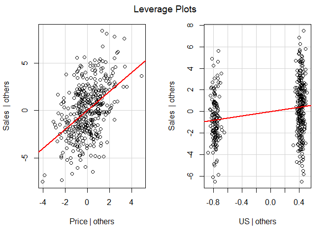 

```r
plot(hatvalues(fit.lm1))
```

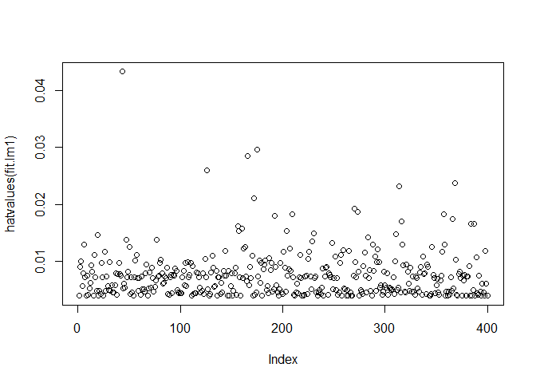 

```r
# average obs leverage (p+1)/n = (2+1)/400 = 0.0075
# data may have some leverage issues
```

***

>EXERCISE 11:

__Part a)__


```r
set.seed(1)
x <- rnorm(100)
y <- 2*x + rnorm(100)
fit.lmY <- lm(y ~ x + 0)
summary(fit.lmY)
```

```
## 
## Call:
## lm(formula = y ~ x + 0)
## 
## Residuals:
##     Min      1Q  Median      3Q     Max 
## -1.9154 -0.6472 -0.1771  0.5056  2.3109 
## 
## Coefficients:
##   Estimate Std. Error t value Pr(>|t|)    
## x   1.9939     0.1065   18.73   <2e-16 ***
## ---
## Signif. codes:  0 '***' 0.001 '**' 0.01 '*' 0.05 '.' 0.1 ' ' 1
## 
## Residual standard error: 0.9586 on 99 degrees of freedom
## Multiple R-squared:  0.7798,	Adjusted R-squared:  0.7776 
## F-statistic: 350.7 on 1 and 99 DF,  p-value: < 2.2e-16
```

Small std. error for coefficient relative to coefficient estimate. p-value is close to zero so statistically significant.

__Part b)__


```r
fit.lmX <- lm(x ~ y + 0)
summary(fit.lmX)
```

```
## 
## Call:
## lm(formula = x ~ y + 0)
## 
## Residuals:
##     Min      1Q  Median      3Q     Max 
## -0.8699 -0.2368  0.1030  0.2858  0.8938 
## 
## Coefficients:
##   Estimate Std. Error t value Pr(>|t|)    
## y  0.39111    0.02089   18.73   <2e-16 ***
## ---
## Signif. codes:  0 '***' 0.001 '**' 0.01 '*' 0.05 '.' 0.1 ' ' 1
## 
## Residual standard error: 0.4246 on 99 degrees of freedom
## Multiple R-squared:  0.7798,	Adjusted R-squared:  0.7776 
## F-statistic: 350.7 on 1 and 99 DF,  p-value: < 2.2e-16
```

Same as Part a). Small std. error for coefficient relative to coefficient estimate. p-value is close to zero so statistically significant.

__Part c)__

$\hat {x} = \hat{\beta_{x}} \times y$ versus $\hat {y} = \hat{\beta_{y}} \times x$, the betas should be inverse of each other ($\hat{\beta_{x}}=\frac{1}{\hat{\beta_{y}}}$) but they are somewhat off

__Part d)__

[*... will come back to this. maybe.*]

__Part e)__

The two regression lines should be the same just with the axes switched, so it would make sense that the t-statistic is the same (both are 18.73).

__Part f)__


```r
fit.lmY2 <- lm(y ~ x)
fit.lmX2 <- lm(x ~ y)
summary(fit.lmY2)
```

```
## 
## Call:
## lm(formula = y ~ x)
## 
## Residuals:
##     Min      1Q  Median      3Q     Max 
## -1.8768 -0.6138 -0.1395  0.5394  2.3462 
## 
## Coefficients:
##             Estimate Std. Error t value Pr(>|t|)    
## (Intercept) -0.03769    0.09699  -0.389    0.698    
## x            1.99894    0.10773  18.556   <2e-16 ***
## ---
## Signif. codes:  0 '***' 0.001 '**' 0.01 '*' 0.05 '.' 0.1 ' ' 1
## 
## Residual standard error: 0.9628 on 98 degrees of freedom
## Multiple R-squared:  0.7784,	Adjusted R-squared:  0.7762 
## F-statistic: 344.3 on 1 and 98 DF,  p-value: < 2.2e-16
```

```r
summary(fit.lmX2)
```

```
## 
## Call:
## lm(formula = x ~ y)
## 
## Residuals:
##      Min       1Q   Median       3Q      Max 
## -0.90848 -0.28101  0.06274  0.24570  0.85736 
## 
## Coefficients:
##             Estimate Std. Error t value Pr(>|t|)    
## (Intercept)  0.03880    0.04266    0.91    0.365    
## y            0.38942    0.02099   18.56   <2e-16 ***
## ---
## Signif. codes:  0 '***' 0.001 '**' 0.01 '*' 0.05 '.' 0.1 ' ' 1
## 
## Residual standard error: 0.4249 on 98 degrees of freedom
## Multiple R-squared:  0.7784,	Adjusted R-squared:  0.7762 
## F-statistic: 344.3 on 1 and 98 DF,  p-value: < 2.2e-16
```

t-statistics for both regressions are 18.56

***

>EXERCISE 12:

__Part a)__

When $x_{i}=y_{i}$, or more generally when the beta denominators are equal $\sum x_{i}^2=\sum y_{i}^2$

__Part b)__


```r
# exercise 11 example works
set.seed(1)
x <- rnorm(100)
y <- 2*x + rnorm(100)
fit.lmY <- lm(y ~ x)
fit.lmX <- lm(x ~ y)
summary(fit.lmY)
```

```
## 
## Call:
## lm(formula = y ~ x)
## 
## Residuals:
##     Min      1Q  Median      3Q     Max 
## -1.8768 -0.6138 -0.1395  0.5394  2.3462 
## 
## Coefficients:
##             Estimate Std. Error t value Pr(>|t|)    
## (Intercept) -0.03769    0.09699  -0.389    0.698    
## x            1.99894    0.10773  18.556   <2e-16 ***
## ---
## Signif. codes:  0 '***' 0.001 '**' 0.01 '*' 0.05 '.' 0.1 ' ' 1
## 
## Residual standard error: 0.9628 on 98 degrees of freedom
## Multiple R-squared:  0.7784,	Adjusted R-squared:  0.7762 
## F-statistic: 344.3 on 1 and 98 DF,  p-value: < 2.2e-16
```

```r
summary(fit.lmX)
```

```
## 
## Call:
## lm(formula = x ~ y)
## 
## Residuals:
##      Min       1Q   Median       3Q      Max 
## -0.90848 -0.28101  0.06274  0.24570  0.85736 
## 
## Coefficients:
##             Estimate Std. Error t value Pr(>|t|)    
## (Intercept)  0.03880    0.04266    0.91    0.365    
## y            0.38942    0.02099   18.56   <2e-16 ***
## ---
## Signif. codes:  0 '***' 0.001 '**' 0.01 '*' 0.05 '.' 0.1 ' ' 1
## 
## Residual standard error: 0.4249 on 98 degrees of freedom
## Multiple R-squared:  0.7784,	Adjusted R-squared:  0.7762 
## F-statistic: 344.3 on 1 and 98 DF,  p-value: < 2.2e-16
```

1.99894 != 0.38942

__Part c)__


```r
set.seed(1)
x <- rnorm(100, mean=1000, sd=0.1)
y <- rnorm(100, mean=1000, sd=0.1)
fit.lmY <- lm(y ~ x)
fit.lmX <- lm(x ~ y)
summary(fit.lmY)
```

```
## 
## Call:
## lm(formula = y ~ x)
## 
## Residuals:
##      Min       1Q   Median       3Q      Max 
## -0.18768 -0.06138 -0.01395  0.05394  0.23462 
## 
## Coefficients:
##               Estimate Std. Error t value Pr(>|t|)    
## (Intercept) 1001.05662  107.72820   9.292 4.16e-15 ***
## x             -0.00106    0.10773  -0.010    0.992    
## ---
## Signif. codes:  0 '***' 0.001 '**' 0.01 '*' 0.05 '.' 0.1 ' ' 1
## 
## Residual standard error: 0.09628 on 98 degrees of freedom
## Multiple R-squared:  9.887e-07,	Adjusted R-squared:  -0.0102 
## F-statistic: 9.689e-05 on 1 and 98 DF,  p-value: 0.9922
```

```r
summary(fit.lmX)
```

```
## 
## Call:
## lm(formula = x ~ y)
## 
## Residuals:
##       Min        1Q    Median        3Q       Max 
## -0.232416 -0.060361  0.000536  0.058305  0.229316 
## 
## Coefficients:
##               Estimate Std. Error t value Pr(>|t|)    
## (Intercept)  1.001e+03  9.472e+01   10.57   <2e-16 ***
## y           -9.324e-04  9.472e-02   -0.01    0.992    
## ---
## Signif. codes:  0 '***' 0.001 '**' 0.01 '*' 0.05 '.' 0.1 ' ' 1
## 
## Residual standard error: 0.09028 on 98 degrees of freedom
## Multiple R-squared:  9.887e-07,	Adjusted R-squared:  -0.0102 
## F-statistic: 9.689e-05 on 1 and 98 DF,  p-value: 0.9922
```

Both betas are 0.005

***

>EXERCISE 13:

__Part a)__


```r
set.seed(1)
x <- rnorm(100)  # mean=0, sd=1 is default
```

__Part b)__


```r
eps <- rnorm(100, sd=0.25^0.5)
```

__Part c)__


```r
y <- -1 + 0.5*x + eps  # eps=epsilon=e 
length(y)
```

```
## [1] 100
```

* length is 100
* $\beta_{0}=-1$
* $\beta_{1}=0.5$

__Part d)__


```r
plot(x,y)
```

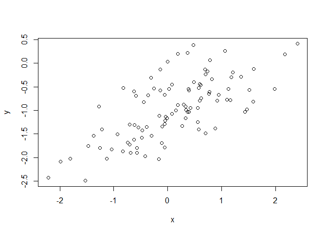 

x and y seem to be positively correlated

__Part e)__


```r
fit.lm <- lm(y ~ x)
summary(fit.lm)
```

```
## 
## Call:
## lm(formula = y ~ x)
## 
## Residuals:
##      Min       1Q   Median       3Q      Max 
## -0.93842 -0.30688 -0.06975  0.26970  1.17309 
## 
## Coefficients:
##             Estimate Std. Error t value Pr(>|t|)    
## (Intercept) -1.01885    0.04849 -21.010  < 2e-16 ***
## x            0.49947    0.05386   9.273 4.58e-15 ***
## ---
## Signif. codes:  0 '***' 0.001 '**' 0.01 '*' 0.05 '.' 0.1 ' ' 1
## 
## Residual standard error: 0.4814 on 98 degrees of freedom
## Multiple R-squared:  0.4674,	Adjusted R-squared:  0.4619 
## F-statistic: 85.99 on 1 and 98 DF,  p-value: 4.583e-15
```

Estimated $\hat{\beta_{0}}=-1.019$ and $\hat{\beta_{1}}=0.499$, which are close to actual betas used to generate `y`

__Part f)__


```r
plot(x,y)
abline(-1, 0.5, col="blue")  # true regression
abline(fit.lm, col="red")    # fitted regression
legend(x = c(0,2.7),
       y = c(-2.5,-2),
       legend = c("population", "model fit"),
       col = c("blue","red"), lwd=2 )
```

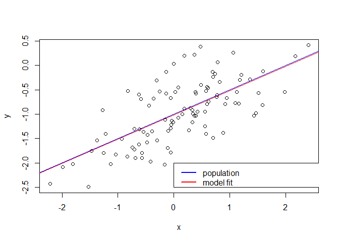 

__Part g)__


```r
fit.lm1 <- lm(y~x+I(x^2))
summary(fit.lm1)
```

```
## 
## Call:
## lm(formula = y ~ x + I(x^2))
## 
## Residuals:
##      Min       1Q   Median       3Q      Max 
## -0.98252 -0.31270 -0.06441  0.29014  1.13500 
## 
## Coefficients:
##             Estimate Std. Error t value Pr(>|t|)    
## (Intercept) -0.97164    0.05883 -16.517  < 2e-16 ***
## x            0.50858    0.05399   9.420  2.4e-15 ***
## I(x^2)      -0.05946    0.04238  -1.403    0.164    
## ---
## Signif. codes:  0 '***' 0.001 '**' 0.01 '*' 0.05 '.' 0.1 ' ' 1
## 
## Residual standard error: 0.479 on 97 degrees of freedom
## Multiple R-squared:  0.4779,	Adjusted R-squared:  0.4672 
## F-statistic:  44.4 on 2 and 97 DF,  p-value: 2.038e-14
```

```r
anova(fit.lm, fit.lm1)
```

```
## Analysis of Variance Table
## 
## Model 1: y ~ x
## Model 2: y ~ x + I(x^2)
##   Res.Df    RSS Df Sum of Sq      F Pr(>F)
## 1     98 22.709                           
## 2     97 22.257  1   0.45163 1.9682 0.1638
```

No evidence of better fit based on high p-value of coefficient for X^2. Estimated coefficient for $\hat{\beta_{1}}$ is farther from true value. Anova test also suggests polynomial fit is not any better.

__Part h)__


```r
eps2 <- rnorm(100, sd=0.1)  # prior sd was 0.5
y2 <- -1 + 0.5*x + eps2
fit.lm2 <- lm(y2 ~ x)
summary(fit.lm2)
```

```
## 
## Call:
## lm(formula = y2 ~ x)
## 
## Residuals:
##       Min        1Q    Median        3Q       Max 
## -0.291411 -0.048230 -0.004533  0.064924  0.264157 
## 
## Coefficients:
##             Estimate Std. Error t value Pr(>|t|)    
## (Intercept) -0.99726    0.01047  -95.25   <2e-16 ***
## x            0.50212    0.01163   43.17   <2e-16 ***
## ---
## Signif. codes:  0 '***' 0.001 '**' 0.01 '*' 0.05 '.' 0.1 ' ' 1
## 
## Residual standard error: 0.1039 on 98 degrees of freedom
## Multiple R-squared:  0.9501,	Adjusted R-squared:  0.9495 
## F-statistic:  1864 on 1 and 98 DF,  p-value: < 2.2e-16
```

```r
plot(x, y2)
abline(-1, 0.5, col="blue")   # true regression
abline(fit.lm2, col="red")    # fitted regression
legend(x = c(-2,-0.5),
       y = c(-0.5,0),
       legend = c("population", "model fit"),
       col = c("blue","red"), lwd=2 )
```

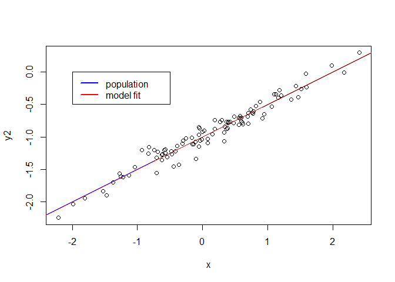 

Decreased variance along regression line. Fit for original y was already very good, so coef estimates are about the same for reduced epsilon. However, RSE and R^2 values are much improved.

__Part i)__


```r
eps3 <- rnorm(100, sd=1)  # orig sd was 0.5
y3 <- -1 + 0.5*x + eps3
fit.lm3 <- lm(y3 ~ x)
summary(fit.lm3)
```

```
## 
## Call:
## lm(formula = y3 ~ x)
## 
## Residuals:
##      Min       1Q   Median       3Q      Max 
## -2.51626 -0.54525 -0.03776  0.67289  1.87887 
## 
## Coefficients:
##             Estimate Std. Error t value Pr(>|t|)    
## (Intercept)  -0.9423     0.1003  -9.397 2.47e-15 ***
## x             0.4443     0.1114   3.989 0.000128 ***
## ---
## Signif. codes:  0 '***' 0.001 '**' 0.01 '*' 0.05 '.' 0.1 ' ' 1
## 
## Residual standard error: 0.9955 on 98 degrees of freedom
## Multiple R-squared:  0.1397,	Adjusted R-squared:  0.1309 
## F-statistic: 15.91 on 1 and 98 DF,  p-value: 0.000128
```

```r
plot(x, y3)
abline(-1, 0.5, col="blue")   # true regression
abline(fit.lm3, col="red")    # fitted regression
legend(x = c(0,2),
       y = c(-4,-3),
       legend = c("population", "model fit"),
       col = c("blue","red"), lwd=2 )
```

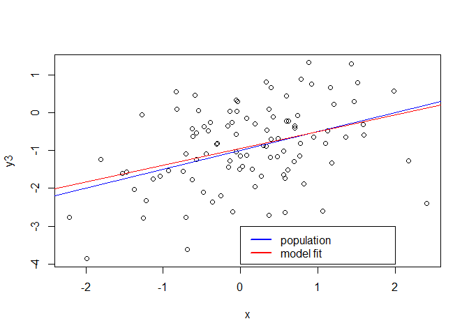 

Coefficient estimates are farther from true value (but not by too much). And, the RSE and R^2 values are worse.

__Part j)__


```r
confint(fit.lm)
```

```
##                  2.5 %     97.5 %
## (Intercept) -1.1150804 -0.9226122
## x            0.3925794  0.6063602
```

```r
confint(fit.lm2)
```

```
##                  2.5 %     97.5 %
## (Intercept) -1.0180413 -0.9764850
## x            0.4790377  0.5251957
```

```r
confint(fit.lm3)
```

```
##                  2.5 %     97.5 %
## (Intercept) -1.1413399 -0.7433293
## x            0.2232721  0.6653558
```

Confidence intervals are tighter for original populations with smaller variance

***

>EXERCISE 14:

__Part a)__


```r
set.seed(1)
x1 <- runif(100)
x2 <- 0.5*x1 + rnorm(100)/10
y <- 2 + 2*x1 + 0.3*x2 + rnorm(100)
```

Population regression is $y = \beta_{0} + \beta_{1} x_1 + \beta_{2} x_2 + \varepsilon$, where $\beta_{0}=2$, $\beta_{1}=2$ and $\beta_{2}=0.3$

__Part b)__


```r
cor(x1,x2)
```

```
## [1] 0.8351212
```

```r
plot(x1,x2)
```

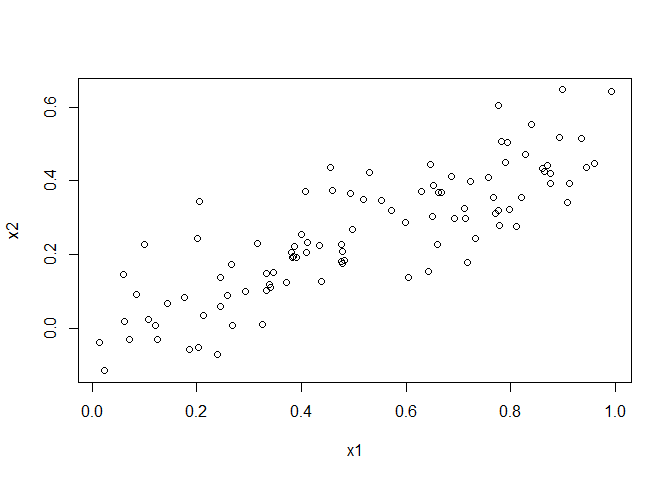 

__Part c)__


```r
fit.lm <- lm(y~x1+x2)
summary(fit.lm)
```

```
## 
## Call:
## lm(formula = y ~ x1 + x2)
## 
## Residuals:
##     Min      1Q  Median      3Q     Max 
## -2.8311 -0.7273 -0.0537  0.6338  2.3359 
## 
## Coefficients:
##             Estimate Std. Error t value Pr(>|t|)    
## (Intercept)   2.1305     0.2319   9.188 7.61e-15 ***
## x1            1.4396     0.7212   1.996   0.0487 *  
## x2            1.0097     1.1337   0.891   0.3754    
## ---
## Signif. codes:  0 '***' 0.001 '**' 0.01 '*' 0.05 '.' 0.1 ' ' 1
## 
## Residual standard error: 1.056 on 97 degrees of freedom
## Multiple R-squared:  0.2088,	Adjusted R-squared:  0.1925 
## F-statistic:  12.8 on 2 and 97 DF,  p-value: 1.164e-05
```

Estimated beta coefficients are $\hat{\beta_{0}}=2.13$, $\hat{\beta_{1}}=1.44$ and $\hat{\beta_{2}}=1.01$. Coefficient for x1 is statistically significant but the coefficient for x2 is not given the presense of x1. These betas try to estimate the population betas: $\hat{\beta_{0}}$ is close (rounds to 2), $\hat{\beta_{1}}$ is 1.44 instead of 2 with a high standard error and $\hat{\beta_{2}}$ is farthest off.

Reject $H_0 : \beta_1=0$; Cannot reject $H_0 : \beta_2=0$

__Part d)__


```r
fit.lm1 <- lm(y~x1)
summary(fit.lm1)
```

```
## 
## Call:
## lm(formula = y ~ x1)
## 
## Residuals:
##      Min       1Q   Median       3Q      Max 
## -2.89495 -0.66874 -0.07785  0.59221  2.45560 
## 
## Coefficients:
##             Estimate Std. Error t value Pr(>|t|)    
## (Intercept)   2.1124     0.2307   9.155 8.27e-15 ***
## x1            1.9759     0.3963   4.986 2.66e-06 ***
## ---
## Signif. codes:  0 '***' 0.001 '**' 0.01 '*' 0.05 '.' 0.1 ' ' 1
## 
## Residual standard error: 1.055 on 98 degrees of freedom
## Multiple R-squared:  0.2024,	Adjusted R-squared:  0.1942 
## F-statistic: 24.86 on 1 and 98 DF,  p-value: 2.661e-06
```

p-value is close to 0, can reject $H_0 : \beta_1=0$

__Part e)__


```r
fit.lm2 <- lm(y~x2)
summary(fit.lm2)
```

```
## 
## Call:
## lm(formula = y ~ x2)
## 
## Residuals:
##      Min       1Q   Median       3Q      Max 
## -2.62687 -0.75156 -0.03598  0.72383  2.44890 
## 
## Coefficients:
##             Estimate Std. Error t value Pr(>|t|)    
## (Intercept)   2.3899     0.1949   12.26  < 2e-16 ***
## x2            2.8996     0.6330    4.58 1.37e-05 ***
## ---
## Signif. codes:  0 '***' 0.001 '**' 0.01 '*' 0.05 '.' 0.1 ' ' 1
## 
## Residual standard error: 1.072 on 98 degrees of freedom
## Multiple R-squared:  0.1763,	Adjusted R-squared:  0.1679 
## F-statistic: 20.98 on 1 and 98 DF,  p-value: 1.366e-05
```

p-value is close to 0, can reject $H_0 : \beta_2=0$

__Part f)__

No. Without the presence of other predictors, both $\beta_1$ and $\beta_2$ are statistically significant. In the presence of other predictors, $\beta_2$ is no longer statistically significant.

__Part g)__


```r
x1 <- c(x1, 0.1)
x2 <- c(x2, 0.8)
y <- c(y, 6)
par(mfrow=c(2,2))
# regression with both x1 and x2
fit.lm <- lm(y~x1+x2)
summary(fit.lm)
```

```
## 
## Call:
## lm(formula = y ~ x1 + x2)
## 
## Residuals:
##      Min       1Q   Median       3Q      Max 
## -2.73348 -0.69318 -0.05263  0.66385  2.30619 
## 
## Coefficients:
##             Estimate Std. Error t value Pr(>|t|)    
## (Intercept)   2.2267     0.2314   9.624 7.91e-16 ***
## x1            0.5394     0.5922   0.911  0.36458    
## x2            2.5146     0.8977   2.801  0.00614 ** 
## ---
## Signif. codes:  0 '***' 0.001 '**' 0.01 '*' 0.05 '.' 0.1 ' ' 1
## 
## Residual standard error: 1.075 on 98 degrees of freedom
## Multiple R-squared:  0.2188,	Adjusted R-squared:  0.2029 
## F-statistic: 13.72 on 2 and 98 DF,  p-value: 5.564e-06
```

```r
plot(fit.lm)
```

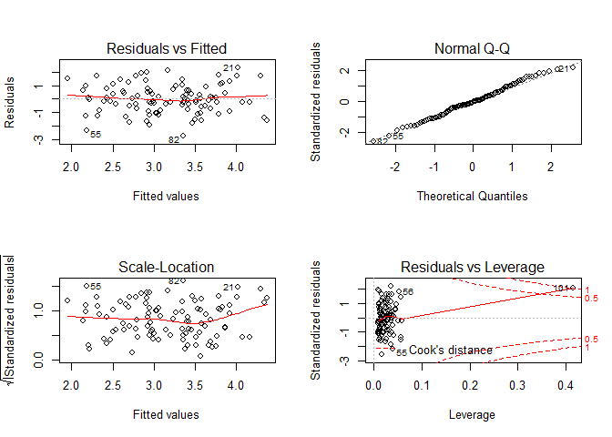 

```r
# regression with x1 only
fit.lm1 <- lm(y~x2)
summary(fit.lm1)
```

```
## 
## Call:
## lm(formula = y ~ x2)
## 
## Residuals:
##      Min       1Q   Median       3Q      Max 
## -2.64729 -0.71021 -0.06899  0.72699  2.38074 
## 
## Coefficients:
##             Estimate Std. Error t value Pr(>|t|)    
## (Intercept)   2.3451     0.1912  12.264  < 2e-16 ***
## x2            3.1190     0.6040   5.164 1.25e-06 ***
## ---
## Signif. codes:  0 '***' 0.001 '**' 0.01 '*' 0.05 '.' 0.1 ' ' 1
## 
## Residual standard error: 1.074 on 99 degrees of freedom
## Multiple R-squared:  0.2122,	Adjusted R-squared:  0.2042 
## F-statistic: 26.66 on 1 and 99 DF,  p-value: 1.253e-06
```

```r
plot(fit.lm1)
```

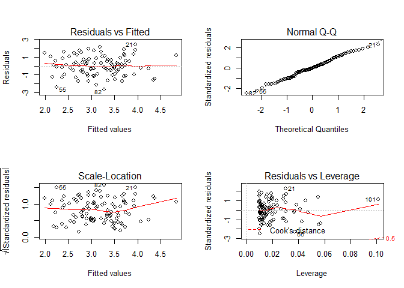 

```r
# regression with x2 only
fit.lm2 <- lm(y~x1)
summary(fit.lm2)
```

```
## 
## Call:
## lm(formula = y ~ x1)
## 
## Residuals:
##     Min      1Q  Median      3Q     Max 
## -2.8897 -0.6556 -0.0909  0.5682  3.5665 
## 
## Coefficients:
##             Estimate Std. Error t value Pr(>|t|)    
## (Intercept)   2.2569     0.2390   9.445 1.78e-15 ***
## x1            1.7657     0.4124   4.282 4.29e-05 ***
## ---
## Signif. codes:  0 '***' 0.001 '**' 0.01 '*' 0.05 '.' 0.1 ' ' 1
## 
## Residual standard error: 1.111 on 99 degrees of freedom
## Multiple R-squared:  0.1562,	Adjusted R-squared:  0.1477 
## F-statistic: 18.33 on 1 and 99 DF,  p-value: 4.295e-05
```

```r
plot(fit.lm2)
```

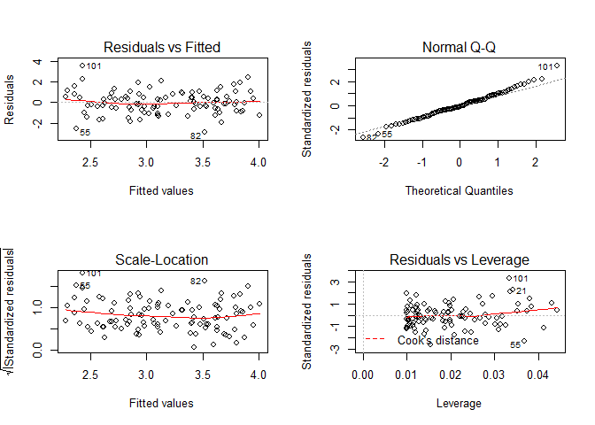 

New point is an outlier for x2 and has high leverage for both x1 and x2. 

* X1 + X2: residuals vs. leverage plot shows obs 101 as standing out. we want to see the red line be close to the dotted black line but the new point causes major issues.
* X1 only: new point has high leverage but doesn't cause issues because new point is not an outlier for x1 or y.
* X2 only: new point has high leverage but doesn't cause major issues because it falls close to the regression line.


```r
plot(x1, y)
```

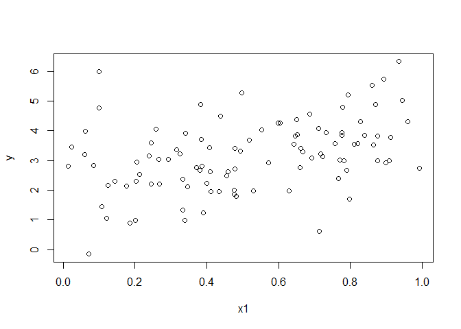 

```r
plot(x2, y)
```

 

***

>EXERCISE 15:

__Part a)__


```r
require(MASS)
data(Boston)
Boston$chas <- factor(Boston$chas, labels = c("N","Y"))
names(Boston)[-1]  # all the potential predictors
```

```
##  [1] "zn"      "indus"   "chas"    "nox"     "rm"      "age"     "dis"    
##  [8] "rad"     "tax"     "ptratio" "black"   "lstat"   "medv"
```

```r
# extract p-value from model object
lmp <- function (modelobject) {
	if (class(modelobject) != "lm") 
	  stop("Not an object of class 'lm' ")
	f <- summary(modelobject)$fstatistic
	p <- pf(f[1],f[2],f[3],lower.tail=F)
	attributes(p) <- NULL
	return(p)
}

results <- combn(names(Boston), 2, 
                 function(x) { lmp(lm(Boston[, x])) }, 
                 simplify = FALSE)
vars <- combn(names(Boston), 2)
names(results) <- paste(vars[1,],vars[2,],sep="~")
results[1:13]  # p-values for response=crim
```

```
## $`crim~zn`
## [1] 5.506472e-06
## 
## $`crim~indus`
## [1] 1.450349e-21
## 
## $`crim~chas`
## [1] 0.2094345
## 
## $`crim~nox`
## [1] 3.751739e-23
## 
## $`crim~rm`
## [1] 6.346703e-07
## 
## $`crim~age`
## [1] 2.854869e-16
## 
## $`crim~dis`
## [1] 8.519949e-19
## 
## $`crim~rad`
## [1] 2.693844e-56
## 
## $`crim~tax`
## [1] 2.357127e-47
## 
## $`crim~ptratio`
## [1] 2.942922e-11
## 
## $`crim~black`
## [1] 2.487274e-19
## 
## $`crim~lstat`
## [1] 2.654277e-27
## 
## $`crim~medv`
## [1] 1.173987e-19
```

Only non-significant predictor is `chas`

__Part b)__


```r
fit.lm <- lm(crim~., data=Boston)
summary(fit.lm)
```

```
## 
## Call:
## lm(formula = crim ~ ., data = Boston)
## 
## Residuals:
##    Min     1Q Median     3Q    Max 
## -9.924 -2.120 -0.353  1.019 75.051 
## 
## Coefficients:
##               Estimate Std. Error t value Pr(>|t|)    
## (Intercept)  17.033228   7.234903   2.354 0.018949 *  
## zn            0.044855   0.018734   2.394 0.017025 *  
## indus        -0.063855   0.083407  -0.766 0.444294    
## chasY        -0.749134   1.180147  -0.635 0.525867    
## nox         -10.313535   5.275536  -1.955 0.051152 .  
## rm            0.430131   0.612830   0.702 0.483089    
## age           0.001452   0.017925   0.081 0.935488    
## dis          -0.987176   0.281817  -3.503 0.000502 ***
## rad           0.588209   0.088049   6.680 6.46e-11 ***
## tax          -0.003780   0.005156  -0.733 0.463793    
## ptratio      -0.271081   0.186450  -1.454 0.146611    
## black        -0.007538   0.003673  -2.052 0.040702 *  
## lstat         0.126211   0.075725   1.667 0.096208 .  
## medv         -0.198887   0.060516  -3.287 0.001087 ** 
## ---
## Signif. codes:  0 '***' 0.001 '**' 0.01 '*' 0.05 '.' 0.1 ' ' 1
## 
## Residual standard error: 6.439 on 492 degrees of freedom
## Multiple R-squared:  0.454,	Adjusted R-squared:  0.4396 
## F-statistic: 31.47 on 13 and 492 DF,  p-value: < 2.2e-16
```

In the presence of other predictors, can reject null hypothesis for the following:

* `zn` 
* `nox`
* `dis`
* `rad`
* `black`
* `lstat`
* `medv`

__Part c)__

Fewer predictors have statistically significant impact when given the presence of other predictors. 


```r
results <- combn(names(Boston), 2, 
                 function(x) { coefficients(lm(Boston[, x])) }, 
                 simplify = FALSE)
(coef.uni <- unlist(results)[seq(2,26,2)])
```

```
##          zn       indus       chasY         nox          rm         age 
## -0.07393498  0.50977633 -1.89277655 31.24853120 -2.68405122  0.10778623 
##         dis         rad         tax     ptratio       black       lstat 
## -1.55090168  0.61791093  0.02974225  1.15198279 -0.03627964  0.54880478 
##        medv 
## -0.36315992
```

```r
(coef.multi <- coefficients(fit.lm)[-1])
```

```
##            zn         indus         chasY           nox            rm 
##   0.044855215  -0.063854824  -0.749133611 -10.313534912   0.430130506 
##           age           dis           rad           tax       ptratio 
##   0.001451643  -0.987175726   0.588208591  -0.003780016  -0.271080558 
##         black         lstat          medv 
##  -0.007537505   0.126211376  -0.198886821
```

```r
plot(coef.uni, coef.multi)
```

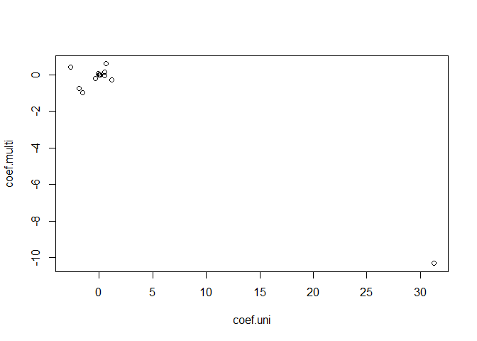 

Beta coefficient estimates are way off for `nox` 

__Part d)__


```r
# skip chas because it's a factor variable
summary(lm(crim~poly(zn,3), data=Boston))      # 1,2
```

```
## 
## Call:
## lm(formula = crim ~ poly(zn, 3), data = Boston)
## 
## Residuals:
##    Min     1Q Median     3Q    Max 
## -4.821 -4.614 -1.294  0.473 84.130 
## 
## Coefficients:
##              Estimate Std. Error t value Pr(>|t|)    
## (Intercept)    3.6135     0.3722   9.709  < 2e-16 ***
## poly(zn, 3)1 -38.7498     8.3722  -4.628  4.7e-06 ***
## poly(zn, 3)2  23.9398     8.3722   2.859  0.00442 ** 
## poly(zn, 3)3 -10.0719     8.3722  -1.203  0.22954    
## ---
## Signif. codes:  0 '***' 0.001 '**' 0.01 '*' 0.05 '.' 0.1 ' ' 1
## 
## Residual standard error: 8.372 on 502 degrees of freedom
## Multiple R-squared:  0.05824,	Adjusted R-squared:  0.05261 
## F-statistic: 10.35 on 3 and 502 DF,  p-value: 1.281e-06
```

```r
summary(lm(crim~poly(indus,3), data=Boston))   # 1,2,3
```

```
## 
## Call:
## lm(formula = crim ~ poly(indus, 3), data = Boston)
## 
## Residuals:
##    Min     1Q Median     3Q    Max 
## -8.278 -2.514  0.054  0.764 79.713 
## 
## Coefficients:
##                 Estimate Std. Error t value Pr(>|t|)    
## (Intercept)        3.614      0.330  10.950  < 2e-16 ***
## poly(indus, 3)1   78.591      7.423  10.587  < 2e-16 ***
## poly(indus, 3)2  -24.395      7.423  -3.286  0.00109 ** 
## poly(indus, 3)3  -54.130      7.423  -7.292  1.2e-12 ***
## ---
## Signif. codes:  0 '***' 0.001 '**' 0.01 '*' 0.05 '.' 0.1 ' ' 1
## 
## Residual standard error: 7.423 on 502 degrees of freedom
## Multiple R-squared:  0.2597,	Adjusted R-squared:  0.2552 
## F-statistic: 58.69 on 3 and 502 DF,  p-value: < 2.2e-16
```

```r
summary(lm(crim~poly(nox,3), data=Boston))     # 1,2,3
```

```
## 
## Call:
## lm(formula = crim ~ poly(nox, 3), data = Boston)
## 
## Residuals:
##    Min     1Q Median     3Q    Max 
## -9.110 -2.068 -0.255  0.739 78.302 
## 
## Coefficients:
##               Estimate Std. Error t value Pr(>|t|)    
## (Intercept)     3.6135     0.3216  11.237  < 2e-16 ***
## poly(nox, 3)1  81.3720     7.2336  11.249  < 2e-16 ***
## poly(nox, 3)2 -28.8286     7.2336  -3.985 7.74e-05 ***
## poly(nox, 3)3 -60.3619     7.2336  -8.345 6.96e-16 ***
## ---
## Signif. codes:  0 '***' 0.001 '**' 0.01 '*' 0.05 '.' 0.1 ' ' 1
## 
## Residual standard error: 7.234 on 502 degrees of freedom
## Multiple R-squared:  0.297,	Adjusted R-squared:  0.2928 
## F-statistic: 70.69 on 3 and 502 DF,  p-value: < 2.2e-16
```

```r
summary(lm(crim~poly(rm,3), data=Boston))      # 1,2
```

```
## 
## Call:
## lm(formula = crim ~ poly(rm, 3), data = Boston)
## 
## Residuals:
##     Min      1Q  Median      3Q     Max 
## -18.485  -3.468  -2.221  -0.015  87.219 
## 
## Coefficients:
##              Estimate Std. Error t value Pr(>|t|)    
## (Intercept)    3.6135     0.3703   9.758  < 2e-16 ***
## poly(rm, 3)1 -42.3794     8.3297  -5.088 5.13e-07 ***
## poly(rm, 3)2  26.5768     8.3297   3.191  0.00151 ** 
## poly(rm, 3)3  -5.5103     8.3297  -0.662  0.50858    
## ---
## Signif. codes:  0 '***' 0.001 '**' 0.01 '*' 0.05 '.' 0.1 ' ' 1
## 
## Residual standard error: 8.33 on 502 degrees of freedom
## Multiple R-squared:  0.06779,	Adjusted R-squared:  0.06222 
## F-statistic: 12.17 on 3 and 502 DF,  p-value: 1.067e-07
```

```r
summary(lm(crim~poly(age,3), data=Boston))     # 1,2,3
```

```
## 
## Call:
## lm(formula = crim ~ poly(age, 3), data = Boston)
## 
## Residuals:
##    Min     1Q Median     3Q    Max 
## -9.762 -2.673 -0.516  0.019 82.842 
## 
## Coefficients:
##               Estimate Std. Error t value Pr(>|t|)    
## (Intercept)     3.6135     0.3485  10.368  < 2e-16 ***
## poly(age, 3)1  68.1820     7.8397   8.697  < 2e-16 ***
## poly(age, 3)2  37.4845     7.8397   4.781 2.29e-06 ***
## poly(age, 3)3  21.3532     7.8397   2.724  0.00668 ** 
## ---
## Signif. codes:  0 '***' 0.001 '**' 0.01 '*' 0.05 '.' 0.1 ' ' 1
## 
## Residual standard error: 7.84 on 502 degrees of freedom
## Multiple R-squared:  0.1742,	Adjusted R-squared:  0.1693 
## F-statistic: 35.31 on 3 and 502 DF,  p-value: < 2.2e-16
```

```r
summary(lm(crim~poly(dis,3), data=Boston))     # 1,2,3
```

```
## 
## Call:
## lm(formula = crim ~ poly(dis, 3), data = Boston)
## 
## Residuals:
##     Min      1Q  Median      3Q     Max 
## -10.757  -2.588   0.031   1.267  76.378 
## 
## Coefficients:
##               Estimate Std. Error t value Pr(>|t|)    
## (Intercept)     3.6135     0.3259  11.087  < 2e-16 ***
## poly(dis, 3)1 -73.3886     7.3315 -10.010  < 2e-16 ***
## poly(dis, 3)2  56.3730     7.3315   7.689 7.87e-14 ***
## poly(dis, 3)3 -42.6219     7.3315  -5.814 1.09e-08 ***
## ---
## Signif. codes:  0 '***' 0.001 '**' 0.01 '*' 0.05 '.' 0.1 ' ' 1
## 
## Residual standard error: 7.331 on 502 degrees of freedom
## Multiple R-squared:  0.2778,	Adjusted R-squared:  0.2735 
## F-statistic: 64.37 on 3 and 502 DF,  p-value: < 2.2e-16
```

```r
summary(lm(crim~poly(rad,3), data=Boston))     # 1,2
```

```
## 
## Call:
## lm(formula = crim ~ poly(rad, 3), data = Boston)
## 
## Residuals:
##     Min      1Q  Median      3Q     Max 
## -10.381  -0.412  -0.269   0.179  76.217 
## 
## Coefficients:
##               Estimate Std. Error t value Pr(>|t|)    
## (Intercept)     3.6135     0.2971  12.164  < 2e-16 ***
## poly(rad, 3)1 120.9074     6.6824  18.093  < 2e-16 ***
## poly(rad, 3)2  17.4923     6.6824   2.618  0.00912 ** 
## poly(rad, 3)3   4.6985     6.6824   0.703  0.48231    
## ---
## Signif. codes:  0 '***' 0.001 '**' 0.01 '*' 0.05 '.' 0.1 ' ' 1
## 
## Residual standard error: 6.682 on 502 degrees of freedom
## Multiple R-squared:    0.4,	Adjusted R-squared:  0.3965 
## F-statistic: 111.6 on 3 and 502 DF,  p-value: < 2.2e-16
```

```r
summary(lm(crim~poly(tax,3), data=Boston))     # 1,2
```

```
## 
## Call:
## lm(formula = crim ~ poly(tax, 3), data = Boston)
## 
## Residuals:
##     Min      1Q  Median      3Q     Max 
## -13.273  -1.389   0.046   0.536  76.950 
## 
## Coefficients:
##               Estimate Std. Error t value Pr(>|t|)    
## (Intercept)     3.6135     0.3047  11.860  < 2e-16 ***
## poly(tax, 3)1 112.6458     6.8537  16.436  < 2e-16 ***
## poly(tax, 3)2  32.0873     6.8537   4.682 3.67e-06 ***
## poly(tax, 3)3  -7.9968     6.8537  -1.167    0.244    
## ---
## Signif. codes:  0 '***' 0.001 '**' 0.01 '*' 0.05 '.' 0.1 ' ' 1
## 
## Residual standard error: 6.854 on 502 degrees of freedom
## Multiple R-squared:  0.3689,	Adjusted R-squared:  0.3651 
## F-statistic:  97.8 on 3 and 502 DF,  p-value: < 2.2e-16
```

```r
summary(lm(crim~poly(ptratio,3), data=Boston)) # 1,2,3
```

```
## 
## Call:
## lm(formula = crim ~ poly(ptratio, 3), data = Boston)
## 
## Residuals:
##    Min     1Q Median     3Q    Max 
## -6.833 -4.146 -1.655  1.408 82.697 
## 
## Coefficients:
##                   Estimate Std. Error t value Pr(>|t|)    
## (Intercept)          3.614      0.361  10.008  < 2e-16 ***
## poly(ptratio, 3)1   56.045      8.122   6.901 1.57e-11 ***
## poly(ptratio, 3)2   24.775      8.122   3.050  0.00241 ** 
## poly(ptratio, 3)3  -22.280      8.122  -2.743  0.00630 ** 
## ---
## Signif. codes:  0 '***' 0.001 '**' 0.01 '*' 0.05 '.' 0.1 ' ' 1
## 
## Residual standard error: 8.122 on 502 degrees of freedom
## Multiple R-squared:  0.1138,	Adjusted R-squared:  0.1085 
## F-statistic: 21.48 on 3 and 502 DF,  p-value: 4.171e-13
```

```r
summary(lm(crim~poly(black,3), data=Boston))   # 1
```

```
## 
## Call:
## lm(formula = crim ~ poly(black, 3), data = Boston)
## 
## Residuals:
##     Min      1Q  Median      3Q     Max 
## -13.096  -2.343  -2.128  -1.439  86.790 
## 
## Coefficients:
##                 Estimate Std. Error t value Pr(>|t|)    
## (Intercept)       3.6135     0.3536  10.218   <2e-16 ***
## poly(black, 3)1 -74.4312     7.9546  -9.357   <2e-16 ***
## poly(black, 3)2   5.9264     7.9546   0.745    0.457    
## poly(black, 3)3  -4.8346     7.9546  -0.608    0.544    
## ---
## Signif. codes:  0 '***' 0.001 '**' 0.01 '*' 0.05 '.' 0.1 ' ' 1
## 
## Residual standard error: 7.955 on 502 degrees of freedom
## Multiple R-squared:  0.1498,	Adjusted R-squared:  0.1448 
## F-statistic: 29.49 on 3 and 502 DF,  p-value: < 2.2e-16
```

```r
summary(lm(crim~poly(lstat,3), data=Boston))   # 1,2
```

```
## 
## Call:
## lm(formula = crim ~ poly(lstat, 3), data = Boston)
## 
## Residuals:
##     Min      1Q  Median      3Q     Max 
## -15.234  -2.151  -0.486   0.066  83.353 
## 
## Coefficients:
##                 Estimate Std. Error t value Pr(>|t|)    
## (Intercept)       3.6135     0.3392  10.654   <2e-16 ***
## poly(lstat, 3)1  88.0697     7.6294  11.543   <2e-16 ***
## poly(lstat, 3)2  15.8882     7.6294   2.082   0.0378 *  
## poly(lstat, 3)3 -11.5740     7.6294  -1.517   0.1299    
## ---
## Signif. codes:  0 '***' 0.001 '**' 0.01 '*' 0.05 '.' 0.1 ' ' 1
## 
## Residual standard error: 7.629 on 502 degrees of freedom
## Multiple R-squared:  0.2179,	Adjusted R-squared:  0.2133 
## F-statistic: 46.63 on 3 and 502 DF,  p-value: < 2.2e-16
```

```r
summary(lm(crim~poly(medv,3), data=Boston))    # 1,2,3
```

```
## 
## Call:
## lm(formula = crim ~ poly(medv, 3), data = Boston)
## 
## Residuals:
##     Min      1Q  Median      3Q     Max 
## -24.427  -1.976  -0.437   0.439  73.655 
## 
## Coefficients:
##                Estimate Std. Error t value Pr(>|t|)    
## (Intercept)       3.614      0.292  12.374  < 2e-16 ***
## poly(medv, 3)1  -75.058      6.569 -11.426  < 2e-16 ***
## poly(medv, 3)2   88.086      6.569  13.409  < 2e-16 ***
## poly(medv, 3)3  -48.033      6.569  -7.312 1.05e-12 ***
## ---
## Signif. codes:  0 '***' 0.001 '**' 0.01 '*' 0.05 '.' 0.1 ' ' 1
## 
## Residual standard error: 6.569 on 502 degrees of freedom
## Multiple R-squared:  0.4202,	Adjusted R-squared:  0.4167 
## F-statistic: 121.3 on 3 and 502 DF,  p-value: < 2.2e-16
```

Yes, there is evidence of non-linear association for many of the predictors.
