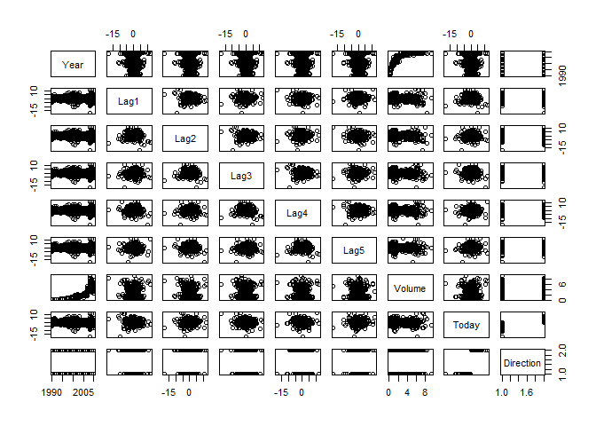
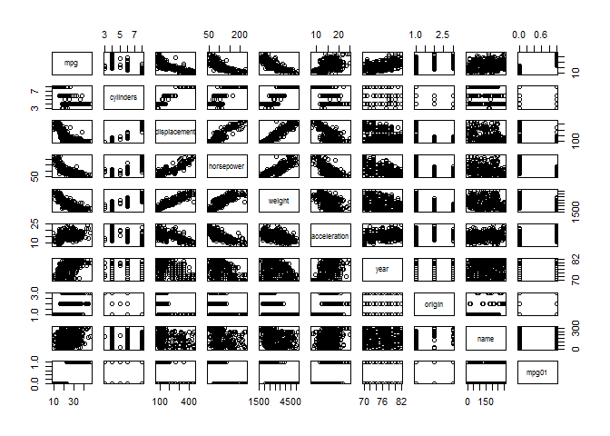
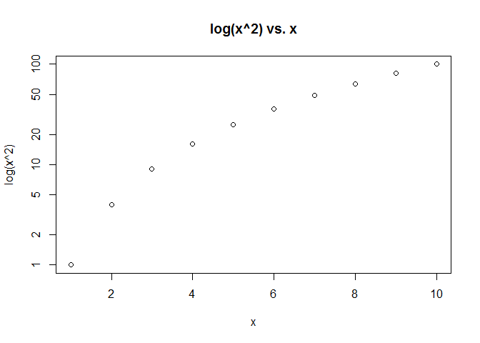
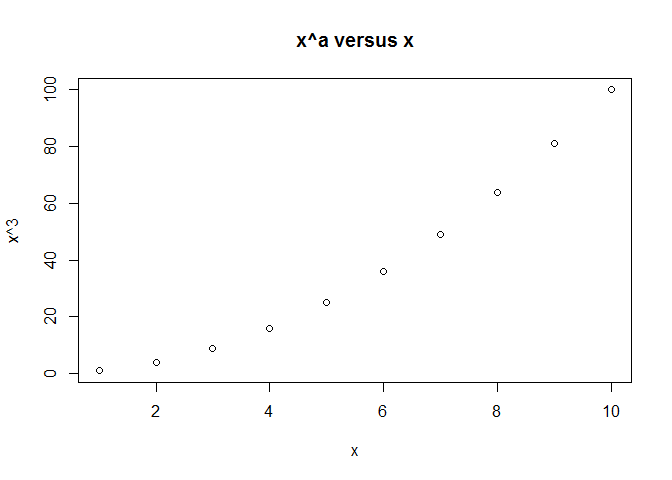
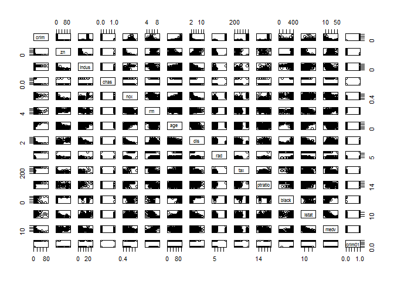

# Chapter 4: Classification
Solutions to Exercises  
January 12, 2016  

***
## CONCEPTUAL
***

>EXERCISE 1:

Let $Z=e^{\beta_0+\beta_1X}$,

Equation (4.2) becomes

  __Step 1:__ $p(X) = \frac{Z}{1+Z}$
 
  __Step 2:__ $\frac{1}{p(X)} = \frac{1+Z}{Z} = 1+\frac{1}{Z}$
 
  __Step 3:__ $Z = \frac{1}{\frac{1}{p(X)}-1} = \frac{1}{\frac{1-p(X)}{p(X)}} = \frac{p(X)}{1-p(X)}$

***

>EXERCISE 2:

Equation (4.12): $p_k(x) = \frac {\pi_k \frac {1} {\sqrt{2 \pi} \sigma} \exp(- \frac {1} {2 \sigma^2} (x - \mu_k)^2) } {\sum { \pi_l \frac {1} {\sqrt{2 \pi} \sigma} \exp(- \frac {1} {2 \sigma^2} (x - \mu_l)^2) }}$

Substitute $C = \frac { \frac {1} {\sqrt{2 \pi} \sigma} \exp(- \frac {1} {2 \sigma^2} (x^2)) } {\sum { \pi_l \frac {1} {\sqrt{2 \pi} \sigma} \exp(- \frac {1} {2 \sigma^2} (x - \mu_l)^2) }}$ as this term does not vary across $k$

  __Step 1:__ Equation becomes $p_k(x) = C \pi_k \exp(- \frac {1} {2 \sigma^2} (\mu_k^2 - 2x \mu_k))$
  
  __Step 2:__ Take log of both sides $log(p_k(x)) = log(C) + log(\pi_k) + (- \frac {1} {2 \sigma^2} (\mu_k^2 - 2x \mu_k))$
  
  __Step 3:__ Simplify and rearrange $log(p_k(x)) =  (\frac {2x \mu_k} {2 \sigma^2} -\frac {\mu_k^2} {2 \sigma^2}) + log(\pi_k) + log(C)$

***

>EXERCISE 3:

If $\sigma$ varies by $k$ then Equation (4.12) becomes: $p_k(x) = \frac {\pi_k \frac {1} {\sqrt{2 \pi} \sigma_k} \exp(- \frac {1} {2 \sigma_k^2} (x - \mu_k)^2) } {\sum { \pi_l \frac {1} {\sqrt{2 \pi} \sigma_k} \exp(- \frac {1} {2 \sigma_k^2} (x - \mu_l)^2) }}$

The constant term that does not vary by $k$ becomes $C' = \frac { \frac {1} {\sqrt{2 \pi}}} {\sum { \pi_l \frac {1} {\sqrt{2 \pi} \sigma_k} \exp(- \frac {1} {2 \sigma_k^2} (x - \mu_l)^2) }}$

  __Step 1:__ Equation becomes $p_k(x) = C' \frac{\pi_k}{\sigma_k} \exp(- \frac {1} {2 \sigma_k^2} (x - \mu_k)^2)$
  
  __Step 2:__ Take log of both sides $log(p_k(x)) = log(C') + log(\pi_k) - log(\sigma_k) + (- \frac {1} {2 \sigma_k^2} (x - \mu_k)^2)$
  
  __Step 3:__ Simplify and rearrange $log(p_k(x)) = (- \frac {1} {2 \sigma_k^2} (x^2 + \mu_k^2 - 2x\mu_k)) + log(\pi_k) - log(\sigma_k) + log(C')$
  
There's the $x^2$.

***

>EXERCISE 4:

__Part a)__

If $X$ is uniformly distributed, then (0.65-0.55)/(1-0) = 10%

__Part b)__

For two features, $10\% \times 10\% = 1\%$

__Part c)__

For 100 features, $10\%^{100}=$ _a very small number_

__Part d)__

When there are a large number of dimensions, the percentage of observations that can be used to predict with KNN becomes very small. This means that for a set sample size, more features leads to fewer neighbors.

__Part e)__

* For p=1, side = 0.1
* For p=2, side = 0.1^(1/2) = 0.316
* For p=100, side = 0.1^(1/100) = 0.977

This is saying that when the number of features is high (i.e. p=100), to use on average 10% of the training observations would mean that we would need to include almost the entire range of each individual feature.

***

>EXERCISE 5:

__Part a)__

If the actual decision boundary is linear, then we would expect LDA to perform better on the test set. For the training set, QDA has a chance of performing better if it overfits.

__Part b)__

QDA would likely perform better on both the training set and the test set. 

__Part c)__

In general a large sample size is more beneficial for QDA so would expect QDA accuracy to increase more than LDA. 

__Part d)__

FALSE: We might achieve a better error rate on the training set but not on the test set because if the true decision boundary is linear then the QDA is not flexible in any predictive way.

***

>EXERCISE 6:

__Part a)__

For logistic regression, $p(X) = \frac{e^{\beta_0+\beta_1 X_1+\beta_2 X_2}}{1+e^{\beta_0+\beta_1 X_1+\beta_2 X_2}}$

Plugging in the values $p(X) = \frac{e^{-6 + 0.05 \times 40 + 1 \times 3.5}}{1+e^{-6+0.05 \times 40 + 1 \times 3.5}} =$


```r
exp(-6+0.05*40+1*3.5)/(1+exp(-6+0.05*40+1*3.5))  #0.38
```

```
## [1] 0.3775407
```

__Part b)__

Solve this equation $0.5 = \frac{e^{-6 + 0.05 X_1 + 1 \times 3.5}}{1+e^{-6+0.05 X_1 + 1 \times 3.5}}$

Which equates to solving the logit equation $log(\frac{0.5}{1-0.5}) = -6 + 0.05 X_1 + 1 \times 3.5$


```r
(log(0.5/(1-0.5)) + 6 - 3.5*1)/0.05  #50
```

```
## [1] 50
```

Student needs to study for 50 hours.

***

>EXERCISE 7:

For constant variance, $p_k(x) = \frac {\pi_k \frac {1} {\sqrt{2 \pi} \sigma} \exp(- \frac {1} {2 \sigma^2} (x - \mu_k)^2) } {\sum { \pi_l \frac {1} {\sqrt{2 \pi} \sigma} \exp(- \frac {1} {2 \sigma^2} (x - \mu_l)^2) }}$

Evaluating this becomes $p_{yes}(4) = \frac {0.8 \exp(- \frac {1} {2 \times 36} (4 - 10)^2)} {0.8 \exp(- \frac {1} {2 \times 36} (4 - 10)^2) + (1-0.8) \exp(- \frac {1} {2 \times 36} (4 - 0)^2)}$


```r
(0.8*exp(-1/(2*36)*(4-10)^2))/(0.8*exp(-1/(2*36)*(4-10)^2)+(1-0.8)*exp(-1/(2*36)*(4-0)^2))
```

```
## [1] 0.7518525
```

Probability is 75.2%

***

>EXERCISE 8:

There's not enough information to say which method is better. With such a high error rate for the logistic regression, it's possible that the true decision boundary is not linear, so KNN=1 might have a better fit. On the other hand, KNN=1 has a high propensity to overfit. With KNN=1 having an average error of 18%, it's possible that the training error is close to 0% and the test error is more than 30%. If we are selecting the model with only error rate data, then we want to know which model has the lower __test__ error rate.

***

>EXERCISE 9:

__Part a)__

We want to solve $0.37 = \frac{p_{default}}{1-p_{default}}$

Rearranging, this becomes $\frac{1}{0.37} = \frac{1-p_{default}}{p_{default}} = \frac{1}{p_{default}}-1$

Finally $p_{default} = \frac{1}{\frac{1}{0.37}+1}$


```r
1/(1/0.37+1)
```

```
## [1] 0.270073
```

Probability of default is 27.0%

__Part b)__


```r
0.16/(1-0.16)
```

```
## [1] 0.1904762
```

Odds of defaulting is 0.19

***
## APPLIED
***

>EXERCISE 10:

__Part a)__


```r
require(ISLR)
data(Weekly)
summary(Weekly)
```

```
##       Year           Lag1               Lag2               Lag3         
##  Min.   :1990   Min.   :-18.1950   Min.   :-18.1950   Min.   :-18.1950  
##  1st Qu.:1995   1st Qu.: -1.1540   1st Qu.: -1.1540   1st Qu.: -1.1580  
##  Median :2000   Median :  0.2410   Median :  0.2410   Median :  0.2410  
##  Mean   :2000   Mean   :  0.1506   Mean   :  0.1511   Mean   :  0.1472  
##  3rd Qu.:2005   3rd Qu.:  1.4050   3rd Qu.:  1.4090   3rd Qu.:  1.4090  
##  Max.   :2010   Max.   : 12.0260   Max.   : 12.0260   Max.   : 12.0260  
##       Lag4               Lag5              Volume       
##  Min.   :-18.1950   Min.   :-18.1950   Min.   :0.08747  
##  1st Qu.: -1.1580   1st Qu.: -1.1660   1st Qu.:0.33202  
##  Median :  0.2380   Median :  0.2340   Median :1.00268  
##  Mean   :  0.1458   Mean   :  0.1399   Mean   :1.57462  
##  3rd Qu.:  1.4090   3rd Qu.:  1.4050   3rd Qu.:2.05373  
##  Max.   : 12.0260   Max.   : 12.0260   Max.   :9.32821  
##      Today          Direction 
##  Min.   :-18.1950   Down:484  
##  1st Qu.: -1.1540   Up  :605  
##  Median :  0.2410             
##  Mean   :  0.1499             
##  3rd Qu.:  1.4050             
##  Max.   : 12.0260
```

```r
pairs(Weekly)
```

 

`Year` and `Volume` are positively correlated similar to the `Smarket` data set.

__Part b)__


```r
fit.logit <- glm(Direction~., data=Weekly[,c(2:7,9)], family=binomial)
summary(fit.logit)
```

```
## 
## Call:
## glm(formula = Direction ~ ., family = binomial, data = Weekly[, 
##     c(2:7, 9)])
## 
## Deviance Residuals: 
##     Min       1Q   Median       3Q      Max  
## -1.6949  -1.2565   0.9913   1.0849   1.4579  
## 
## Coefficients:
##             Estimate Std. Error z value Pr(>|z|)   
## (Intercept)  0.26686    0.08593   3.106   0.0019 **
## Lag1        -0.04127    0.02641  -1.563   0.1181   
## Lag2         0.05844    0.02686   2.175   0.0296 * 
## Lag3        -0.01606    0.02666  -0.602   0.5469   
## Lag4        -0.02779    0.02646  -1.050   0.2937   
## Lag5        -0.01447    0.02638  -0.549   0.5833   
## Volume      -0.02274    0.03690  -0.616   0.5377   
## ---
## Signif. codes:  0 '***' 0.001 '**' 0.01 '*' 0.05 '.' 0.1 ' ' 1
## 
## (Dispersion parameter for binomial family taken to be 1)
## 
##     Null deviance: 1496.2  on 1088  degrees of freedom
## Residual deviance: 1486.4  on 1082  degrees of freedom
## AIC: 1500.4
## 
## Number of Fisher Scoring iterations: 4
```

`Lag2` seems to have statistically significant predictive value

__Part c)__


```r
logit.prob <- predict(fit.logit, Weekly, type="response")
logit.pred <- ifelse(logit.prob > 0.5, "Up", "Down")
table(logit.pred, Weekly$Direction)
```

```
##           
## logit.pred Down  Up
##       Down   54  48
##       Up    430 557
```

```r
(54+557)/nrow(Weekly)  # Accuracy=0.56
```

```
## [1] 0.5610652
```

* When prediction is "Down", model is right 54/(54+48)=52.9%.
* When prediction is "Up", model is right 557/(430+557)=56.4%

Model is has higher accuracy when the prediction is "Up"

__Part d)__


```r
train.yrs <- Weekly$Year %in% (1990:2008)
train <- Weekly[train.yrs,]
test <- Weekly[!train.yrs,]
fit2 <- glm(Direction~Lag2, data=train, family=binomial)
fit2.prob <- predict(fit2, test, type="response")
fit2.pred <- ifelse(fit2.prob > 0.5, "Up", "Down")
table(fit2.pred, test$Direction)
```

```
##          
## fit2.pred Down Up
##      Down    9  5
##      Up     34 56
```

```r
mean(fit2.pred == test$Direction)  # Accuracy=0.625
```

```
## [1] 0.625
```

__Part e)__


```r
require(MASS)
fit.lda <- lda(Direction~Lag2, data=train)
fit.lda.pred <- predict(fit.lda, test)$class
table(fit.lda.pred, test$Direction)
```

```
##             
## fit.lda.pred Down Up
##         Down    9  5
##         Up     34 56
```

```r
mean(fit.lda.pred == test$Direction)  # Accuracy=0.625
```

```
## [1] 0.625
```

__Part f)__


```r
fit.qda <- qda(Direction~Lag2, data=train)
fit.qda.pred <- predict(fit.qda, test)$class
table(fit.qda.pred, test$Direction)
```

```
##             
## fit.qda.pred Down Up
##         Down    0  0
##         Up     43 61
```

```r
mean(fit.qda.pred == test$Direction)  # Accuracy=0.587
```

```
## [1] 0.5865385
```

__Part g)__


```r
require(class)
set.seed(1)
train.X <- as.matrix(train$Lag2)
test.X <- as.matrix(test$Lag2)
knn.pred <- knn(train.X, test.X, train$Direction, k=1)
table(knn.pred, test$Direction)
```

```
##         
## knn.pred Down Up
##     Down   21 30
##     Up     22 31
```

```r
mean(knn.pred == test$Direction)  # Accuracy=0.500
```

```
## [1] 0.5
```

__Part h)__

The Logistic Regression and LDA models produced the best results

__Part i)__


```r
knn.pred <- knn(train.X, test.X, train$Direction, k=5)
table(knn.pred, test$Direction)
```

```
##         
## knn.pred Down Up
##     Down   15 20
##     Up     28 41
```

```r
mean(knn.pred == test$Direction)
```

```
## [1] 0.5384615
```

```r
knn.pred <- knn(train.X, test.X, train$Direction, k=10)
table(knn.pred, test$Direction)
```

```
##         
## knn.pred Down Up
##     Down   17 19
##     Up     26 42
```

```r
mean(knn.pred == test$Direction)
```

```
## [1] 0.5673077
```

```r
knn.pred <- knn(train.X, test.X, train$Direction, k=20)
table(knn.pred, test$Direction)
```

```
##         
## knn.pred Down Up
##     Down   21 20
##     Up     22 41
```

```r
mean(knn.pred == test$Direction)
```

```
## [1] 0.5961538
```

```r
knn.pred <- knn(train.X, test.X, train$Direction, k=30)
table(knn.pred, test$Direction)
```

```
##         
## knn.pred Down Up
##     Down   19 21
##     Up     24 40
```

```r
mean(knn.pred == test$Direction)
```

```
## [1] 0.5673077
```

Higher k values for KNN (around 20) seemed to produce the best results when using only Lag2 as predictor.


```r
fit.lda <- lda(Direction~Lag2+I(Lag1^2), data=train)
fit.lda.pred <- predict(fit.lda, test)$class
table(fit.lda.pred, test$Direction)
```

```
##             
## fit.lda.pred Down Up
##         Down    8  2
##         Up     35 59
```

```r
mean(fit.lda.pred == test$Direction)  # Accuracy=0.644
```

```
## [1] 0.6442308
```

***

>EXERCISE 11:

__Part a)__


```r
require(ISLR)
data(Auto)
mpg01 <- ifelse(Auto$mpg > median(Auto$mpg), 1, 0)
mydf <- data.frame(Auto, mpg01)
```

__Part b)__


```r
pairs(mydf)
```

 

`displacement`, `horsepower`, `weight` and `acceleration` seem to be highly correlated

__Part c)__


```r
set.seed(1)
trainid <- sample(1:nrow(mydf), nrow(mydf)*0.7 , replace=F)  # 70% train, 30% test
train <- mydf[trainid,]
test <- mydf[-trainid,]
```

__Part d)__


```r
fit.lda <- lda(mpg01~displacement+horsepower+weight+acceleration, data=train)
fit.lda.pred <- predict(fit.lda, test)$class
table(fit.lda.pred, test$mpg01)
```

```
##             
## fit.lda.pred  0  1
##            0 47  0
##            1 10 61
```

```r
mean(fit.lda.pred != test$mpg01)  # error rate
```

```
## [1] 0.08474576
```

__Part e)__


```r
fit.qda <- qda(mpg01~displacement+horsepower+weight+acceleration, data=train)
fit.qda.pred <- predict(fit.qda, test)$class
table(fit.qda.pred, test$mpg01)
```

```
##             
## fit.qda.pred  0  1
##            0 48  3
##            1  9 58
```

```r
mean(fit.qda.pred != test$mpg01)  # error rate
```

```
## [1] 0.1016949
```

__Part f)__


```r
fit.logit <- glm(mpg01~displacement+horsepower+weight+acceleration, data=train, family=binomial)
logit.prob <- predict(fit.logit, test, type="response")
logit.pred <- ifelse(logit.prob > 0.5, 1, 0)
table(logit.pred, test$mpg01)
```

```
##           
## logit.pred  0  1
##          0 50  3
##          1  7 58
```

```r
mean(logit.pred != test$mpg01)  # error rate
```

```
## [1] 0.08474576
```

__Part g)__


```r
train.X <- cbind(train$displacement, train$horsepower, train$weight, train$acceleration)
test.X <- cbind(test$displacement, test$horsepower, test$weight, test$acceleration)
knn.pred <- knn(train.X, test.X, train$mpg01, k=1)
table(knn.pred, test$mpg01)
```

```
##         
## knn.pred  0  1
##        0 47  9
##        1 10 52
```

```r
mean(knn.pred != test$mpg01)
```

```
## [1] 0.1610169
```

```r
knn.pred <- knn(train.X, test.X, train$mpg01, k=10)
table(knn.pred, test$mpg01)
```

```
##         
## knn.pred  0  1
##        0 43  2
##        1 14 59
```

```r
mean(knn.pred != test$mpg01)
```

```
## [1] 0.1355932
```

```r
knn.pred <- knn(train.X, test.X, train$mpg01, k=20)
table(knn.pred, test$mpg01)
```

```
##         
## knn.pred  0  1
##        0 42  2
##        1 15 59
```

```r
mean(knn.pred != test$mpg01)
```

```
## [1] 0.1440678
```

```r
knn.pred <- knn(train.X, test.X, train$mpg01, k=30)
table(knn.pred, test$mpg01)
```

```
##         
## knn.pred  0  1
##        0 49  3
##        1  8 58
```

```r
mean(knn.pred != test$mpg01)
```

```
## [1] 0.09322034
```

```r
knn.pred <- knn(train.X, test.X, train$mpg01, k=50)
table(knn.pred, test$mpg01)
```

```
##         
## knn.pred  0  1
##        0 46  2
##        1 11 59
```

```r
mean(knn.pred != test$mpg01)
```

```
## [1] 0.1101695
```

```r
knn.pred <- knn(train.X, test.X, train$mpg01, k=100)
table(knn.pred, test$mpg01)
```

```
##         
## knn.pred  0  1
##        0 49  2
##        1  8 59
```

```r
mean(knn.pred != test$mpg01)
```

```
## [1] 0.08474576
```

```r
knn.pred <- knn(train.X, test.X, train$mpg01, k=200)
table(knn.pred, test$mpg01)
```

```
##         
## knn.pred  0  1
##        0 41  2
##        1 16 59
```

```r
mean(knn.pred != test$mpg01)
```

```
## [1] 0.1525424
```

KNN performs best around k=30 and k=100

***

>EXERCISE 12:

__Part a)__


```r
Power <- function() {
  print(2^3)
}
Power()
```

```
## [1] 8
```

__Part b)__


```r
Power2 <- function(x, a) {
  print(x^a)
}
Power2(3,8)
```

```
## [1] 6561
```

__Part c)__


```r
Power2(10,3)
```

```
## [1] 1000
```

```r
Power2(8,17)
```

```
## [1] 2.2518e+15
```

```r
Power2(131,3)
```

```
## [1] 2248091
```

__Part d)__


```r
Power3 <- function(x, a) {
  return(x^a)
}
Power3(3,8)
```

```
## [1] 6561
```

__Part e)__


```r
x <- 1:10
plot(x, Power3(x,2), log="y", main="log(x^2) vs. x",
     xlab="x", ylab="log(x^2)")
```

 

__Part f)__


```r
PlotPower <- function(x, a) {
  plot(x, Power3(x,2), main="x^a versus x",
       xlab="x", ylab=paste0("x^",a))
}
PlotPower(1:10,3)
```

 

***

>EXERCISE 13:


```r
data(Boston)
summary(Boston)
```

```
##       crim                zn             indus            chas        
##  Min.   : 0.00632   Min.   :  0.00   Min.   : 0.46   Min.   :0.00000  
##  1st Qu.: 0.08204   1st Qu.:  0.00   1st Qu.: 5.19   1st Qu.:0.00000  
##  Median : 0.25651   Median :  0.00   Median : 9.69   Median :0.00000  
##  Mean   : 3.61352   Mean   : 11.36   Mean   :11.14   Mean   :0.06917  
##  3rd Qu.: 3.67708   3rd Qu.: 12.50   3rd Qu.:18.10   3rd Qu.:0.00000  
##  Max.   :88.97620   Max.   :100.00   Max.   :27.74   Max.   :1.00000  
##       nox               rm             age              dis        
##  Min.   :0.3850   Min.   :3.561   Min.   :  2.90   Min.   : 1.130  
##  1st Qu.:0.4490   1st Qu.:5.886   1st Qu.: 45.02   1st Qu.: 2.100  
##  Median :0.5380   Median :6.208   Median : 77.50   Median : 3.207  
##  Mean   :0.5547   Mean   :6.285   Mean   : 68.57   Mean   : 3.795  
##  3rd Qu.:0.6240   3rd Qu.:6.623   3rd Qu.: 94.08   3rd Qu.: 5.188  
##  Max.   :0.8710   Max.   :8.780   Max.   :100.00   Max.   :12.127  
##       rad              tax           ptratio          black       
##  Min.   : 1.000   Min.   :187.0   Min.   :12.60   Min.   :  0.32  
##  1st Qu.: 4.000   1st Qu.:279.0   1st Qu.:17.40   1st Qu.:375.38  
##  Median : 5.000   Median :330.0   Median :19.05   Median :391.44  
##  Mean   : 9.549   Mean   :408.2   Mean   :18.46   Mean   :356.67  
##  3rd Qu.:24.000   3rd Qu.:666.0   3rd Qu.:20.20   3rd Qu.:396.23  
##  Max.   :24.000   Max.   :711.0   Max.   :22.00   Max.   :396.90  
##      lstat            medv      
##  Min.   : 1.73   Min.   : 5.00  
##  1st Qu.: 6.95   1st Qu.:17.02  
##  Median :11.36   Median :21.20  
##  Mean   :12.65   Mean   :22.53  
##  3rd Qu.:16.95   3rd Qu.:25.00  
##  Max.   :37.97   Max.   :50.00
```

```r
crim01 <- ifelse(Boston$crim > median(Boston$crim), 1, 0)
mydf <- data.frame(Boston, crim01)
pairs(mydf)  # pred1 = age, dis, lstat, medv
```

 

```r
sort(cor(mydf)[1,])  # pred2 = tax, rad (highest correlations with crim)
```

```
##        medv       black         dis          rm          zn        chas 
## -0.38830461 -0.38506394 -0.37967009 -0.21924670 -0.20046922 -0.05589158 
##     ptratio         age       indus      crim01         nox       lstat 
##  0.28994558  0.35273425  0.40658341  0.40939545  0.42097171  0.45562148 
##         tax         rad        crim 
##  0.58276431  0.62550515  1.00000000
```

```r
set.seed(1)
trainid <- sample(1:nrow(mydf), nrow(mydf)*0.7 , replace=F)  # 70% train, 30% test
train <- mydf[trainid,]
test <- mydf[-trainid,]
train.X1 <- cbind(train$age, train$dis, train$lstat, train$medv)
test.X1 <- cbind(test$age, test$dis, test$lstat, test$medv)
train.X2 <- cbind(train$tax, train$rad)
test.X2 <- cbind(test$tax, test$rad)

# Logistic Regression models
fit.logit1 <- glm(crim01~age+dis+lstat+medv, data=train, family=binomial)
logit1.prob <- predict(fit.logit1, test, type="response")
logit1.pred <- ifelse(logit1.prob > 0.5, 1, 0)
mean(logit1.pred != test$crim01)  # error rate
```

```
## [1] 0.1644737
```

```r
fit.logit2 <- glm(crim01~tax+rad, data=train, family=binomial)
logit2.prob <- predict(fit.logit2, test, type="response")
logit2.pred <- ifelse(logit2.prob > 0.5, 1, 0)
mean(logit2.pred != test$crim01)  # error rate
```

```
## [1] 0.2434211
```

```r
# LDA models
fit.lda1 <- lda(crim01~age+dis+lstat+medv, data=train)
fit.lda1.pred <- predict(fit.lda1, test)$class
mean(fit.lda1.pred != test$crim01)  # error rate
```

```
## [1] 0.1776316
```

```r
fit.lda2 <- lda(crim01~tax+rad, data=train)
fit.lda2.pred <- predict(fit.lda2, test)$class
mean(fit.lda2.pred != test$crim01)  # error rate
```

```
## [1] 0.2763158
```

```r
# QDA models
fit.qda1 <- qda(crim01~age+dis+lstat+medv, data=train)
fit.qda1.pred <- predict(fit.qda1, test)$class
mean(fit.qda1.pred != test$crim01)  # error rate
```

```
## [1] 0.1776316
```

```r
fit.qda2 <- qda(crim01~tax+rad, data=train)
fit.qda2.pred <- predict(fit.qda2, test)$class
mean(fit.qda2.pred != test$crim01)  # error rate
```

```
## [1] 0.2631579
```

```r
# KNN models
set.seed(1)
knn1.pred <- knn(train.X1, test.X1, train$crim01, k=1)
mean(knn1.pred != test$crim01)
```

```
## [1] 0.25
```

```r
knn1.pred <- knn(train.X1, test.X1, train$crim01, k=5)
mean(knn1.pred != test$crim01)
```

```
## [1] 0.1907895
```

```r
knn1.pred <- knn(train.X1, test.X1, train$crim01, k=10)
mean(knn1.pred != test$crim01)
```

```
## [1] 0.2039474
```

```r
knn1.pred <- knn(train.X1, test.X1, train$crim01, k=20)
mean(knn1.pred != test$crim01)
```

```
## [1] 0.1842105
```

```r
knn1.pred <- knn(train.X1, test.X1, train$crim01, k=50)
mean(knn1.pred != test$crim01)
```

```
## [1] 0.1842105
```

```r
knn1.pred <- knn(train.X1, test.X1, train$crim01, k=100)
mean(knn1.pred != test$crim01)
```

```
## [1] 0.1842105
```

```r
knn1.pred <- knn(train.X1, test.X1, train$crim01, k=200)
mean(knn1.pred != test$crim01)
```

```
## [1] 0.1907895
```

```r
knn2.pred <- knn(train.X2, test.X2, train$crim01, k=1)
mean(knn2.pred != test$crim01)
```

```
## [1] 0.06578947
```

```r
knn2.pred <- knn(train.X2, test.X2, train$crim01, k=5)
mean(knn2.pred != test$crim01)
```

```
## [1] 0.1118421
```

```r
knn2.pred <- knn(train.X2, test.X2, train$crim01, k=10)
mean(knn2.pred != test$crim01)
```

```
## [1] 0.1710526
```

```r
knn2.pred <- knn(train.X2, test.X2, train$crim01, k=20)
mean(knn2.pred != test$crim01)
```

```
## [1] 0.1513158
```

```r
knn2.pred <- knn(train.X2, test.X2, train$crim01, k=50)
mean(knn2.pred != test$crim01)
```

```
## [1] 0.2894737
```

```r
knn2.pred <- knn(train.X2, test.X2, train$crim01, k=100)
mean(knn2.pred != test$crim01)
```

```
## [1] 0.2894737
```

```r
knn2.pred <- knn(train.X2, test.X2, train$crim01, k=200)
mean(knn2.pred != test$crim01)
```

```
## [1] 0.2763158
```

Surprisingly, the KNN model with two predictors `tax` and `rad` and k=1 had the best error rate
