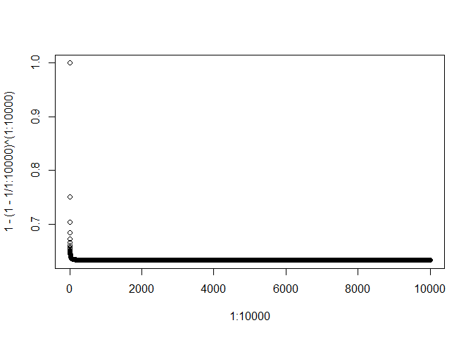
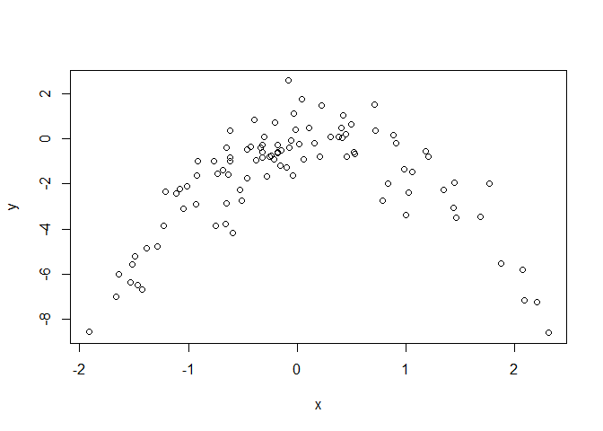

# Chapter 5: Resampling Methods
Solutions to Exercises  
January 18, 2016  

***
## CONCEPTUAL
***

>EXERCISE 1:

$$ Var(\alpha X + (1-\alpha)Y) \\
= Var(\alpha X) + Var((1-\alpha)Y) +2 Cov(\alpha X, (1-\alpha)Y) \\
= \alpha^2 \sigma_X^2 + (1-\alpha)^2 \sigma_Y^2 + 2 \alpha (1-\alpha) \sigma_{XY} \\
= \alpha^2 \sigma_X^2 + (1+\alpha^2-2\alpha) \sigma_Y^2 + (2\alpha - 2\alpha^2) \sigma_{XY} \\
= \alpha^2 \sigma_X^2 + \sigma_Y^2+\alpha^2\sigma_Y^2-2\alpha\sigma_Y^2 + 2\alpha \sigma_{XY} - 2\alpha^2 \sigma_{XY} $$

$$ \frac{\partial }{\partial \alpha}: 2\alpha\sigma_X^2 + 0 + 2\alpha\sigma_Y^2 - 2\sigma_Y^2 + 2\sigma_{XY} - 4\alpha\sigma_{XY} = 0 $$

$$ (2\sigma_X^2 + 2\sigma_Y^2 - 4\sigma_{XY}) \alpha = 2\sigma_Y^2 - 2\sigma_{XY} $$

$$ \alpha = \frac{\sigma_Y^2 - \sigma_{XY}}{\sigma_X^2 + \sigma_Y^2 - 2\sigma_{XY}} $$

***

>EXERCISE 2:

__Part a)__

Probability is equal to not selecting that one observation out of all observations: $\frac{n-1}{n}$

__Part b)__

Because bootstrap uses replacement, the probability is the same as Part a: $\frac{n-1}{n}$

__Part c)__

Probability of not selecting the *j*th observation is the same for each selection. After $n$ selections, the probability of never selecting the *j*th observation is: $(\frac{n-1}{n})^n = (1-\frac{1}{n})^n$

__Part d)__


```r
1-(1-1/5)^5
```

```
## [1] 0.67232
```

__Part e)__


```r
1-(1-1/100)^100
```

```
## [1] 0.6339677
```

__Part f)__


```r
1-(1-1/10000)^10000
```

```
## [1] 0.632139
```

__Part g)__


```r
plot(1:10000, 1-(1-1/1:10000)^(1:10000))
```

\

Probability pretty quickly reaches mid-60%

__Part h)__


```r
store <- rep(NA, 10000)
for (i in 1:10000)
  store[i] <- sum(sample(1:100, rep=TRUE)==4) > 0
mean(store)
```

```
## [1] 0.6357
```

The resulting fraction of 10,000 bootstrap samples that have the 4th observation is close to our predicted probability of 1-(1-1/100)^100 = 63.4%

***

>EXERCISE 3:

__Part a)__

From page 181 in the text, the k-fold CV approach "involves randomly dividing the set of observations into k groups, or folds, of approximately equal size. The first fold is treated as a validation set, and the method is fit on the remaining k-1 folds. The mean squared error, MSE, is then computed on the observations in the held-out fold. This procedure is repeated k times."

__Part b)__

* Compared to the validation set approach, k-fold CV has less variance but more bias
* Compared to LOOCV approach, k-fold CV has more variance but less bias

***

>EXERCISE 4:

We can use the bootstrap method to sample with replacement from our dataset and estimate Y's from each sample. With the results of different predicted Y values, we can then estimate the standard deviation of our prediction. 

***
## APPLIED
***

>EXERCISE 5:

__Part a)__


```r
require(ISLR)
data(Default)
set.seed(1)
fit1 <- glm(default ~ income + balance, data=Default, family=binomial)
summary(fit1)
```

```
## 
## Call:
## glm(formula = default ~ income + balance, family = binomial, 
##     data = Default)
## 
## Deviance Residuals: 
##     Min       1Q   Median       3Q      Max  
## -2.4725  -0.1444  -0.0574  -0.0211   3.7245  
## 
## Coefficients:
##               Estimate Std. Error z value Pr(>|z|)    
## (Intercept) -1.154e+01  4.348e-01 -26.545  < 2e-16 ***
## income       2.081e-05  4.985e-06   4.174 2.99e-05 ***
## balance      5.647e-03  2.274e-04  24.836  < 2e-16 ***
## ---
## Signif. codes:  0 '***' 0.001 '**' 0.01 '*' 0.05 '.' 0.1 ' ' 1
## 
## (Dispersion parameter for binomial family taken to be 1)
## 
##     Null deviance: 2920.6  on 9999  degrees of freedom
## Residual deviance: 1579.0  on 9997  degrees of freedom
## AIC: 1585
## 
## Number of Fisher Scoring iterations: 8
```

__Part b)__


```r
set.seed(1)
train <- sample(nrow(Default), nrow(Default)*0.5)
fit2 <- glm(default ~ income + balance, data=Default, family=binomial, subset=train)
prob2 <- predict(fit2, Default[-train,], type="response")
pred2 <- ifelse(prob2 > 0.5, "Yes", "No")
table(pred2, Default[-train,]$default)
```

```
##      
## pred2   No  Yes
##   No  4805  115
##   Yes   28   52
```

```r
mean(Default[-train,]$default != pred2)  # test error
```

```
## [1] 0.0286
```

__Part c)__


```r
set.seed(2)  # Repeat 1
train <- sample(nrow(Default), nrow(Default)*0.5)
fit2 <- glm(default ~ income + balance, data=Default, family=binomial, subset=train)
prob2 <- predict(fit2, Default[-train,], type="response")
pred2 <- ifelse(prob2 > 0.5, "Yes", "No")
mean(Default[-train,]$default != pred2)  # test error
```

```
## [1] 0.0276
```

```r
set.seed(3)  # Repeat 2
train <- sample(nrow(Default), nrow(Default)*0.5)
fit2 <- glm(default ~ income + balance, data=Default, family=binomial, subset=train)
prob2 <- predict(fit2, Default[-train,], type="response")
pred2 <- ifelse(prob2 > 0.5, "Yes", "No")
mean(Default[-train,]$default != pred2)  # test error
```

```
## [1] 0.0248
```

```r
set.seed(4)  # Repeat 3
train <- sample(nrow(Default), nrow(Default)*0.5)
fit2 <- glm(default ~ income + balance, data=Default, family=binomial, subset=train)
prob2 <- predict(fit2, Default[-train,], type="response")
pred2 <- ifelse(prob2 > 0.5, "Yes", "No")
mean(Default[-train,]$default != pred2)  # test error
```

```
## [1] 0.0262
```

The test error seems consistent around 2.5% (variance is not large)

__Part d)__


```r
set.seed(1)
train <- sample(nrow(Default), nrow(Default)*0.5)
fit3 <- glm(default ~ income + balance + student, data=Default, family=binomial, subset=train)
prob3 <- predict(fit3, Default[-train,], type="response")
pred3 <- ifelse(prob3 > 0.5, "Yes", "No")
mean(Default[-train,]$default != pred3)  # test error
```

```
## [1] 0.0288
```

Test error with the `student` feature included is similar to without including `student` (no significant reduction)

***

>EXERCISE 6:

__Part a)__


```r
require(ISLR)
data(Default)
set.seed(1)
fit1 <- glm(default ~ income + balance, data=Default, family=binomial)
summary(fit1)
```

```
## 
## Call:
## glm(formula = default ~ income + balance, family = binomial, 
##     data = Default)
## 
## Deviance Residuals: 
##     Min       1Q   Median       3Q      Max  
## -2.4725  -0.1444  -0.0574  -0.0211   3.7245  
## 
## Coefficients:
##               Estimate Std. Error z value Pr(>|z|)    
## (Intercept) -1.154e+01  4.348e-01 -26.545  < 2e-16 ***
## income       2.081e-05  4.985e-06   4.174 2.99e-05 ***
## balance      5.647e-03  2.274e-04  24.836  < 2e-16 ***
## ---
## Signif. codes:  0 '***' 0.001 '**' 0.01 '*' 0.05 '.' 0.1 ' ' 1
## 
## (Dispersion parameter for binomial family taken to be 1)
## 
##     Null deviance: 2920.6  on 9999  degrees of freedom
## Residual deviance: 1579.0  on 9997  degrees of freedom
## AIC: 1585
## 
## Number of Fisher Scoring iterations: 8
```

Estimated standard error is 0.000004985 for `income` and 0.0002274 for `balance`

__Part b)__


```r
set.seed(1)
boot.fn <- function(df, trainid) {
  return(coef(glm(default ~ income + balance, data=df, family=binomial, subset=trainid)))
}
boot.fn(Default, 1:nrow(Default))  # check match with summary
```

```
##   (Intercept)        income       balance 
## -1.154047e+01  2.080898e-05  5.647103e-03
```

__Part c)__


```r
require(boot)
```

```
## Loading required package: boot
```

```r
boot(Default, boot.fn, R=100)
```

```
## 
## ORDINARY NONPARAMETRIC BOOTSTRAP
## 
## 
## Call:
## boot(data = Default, statistic = boot.fn, R = 100)
## 
## 
## Bootstrap Statistics :
##          original        bias     std. error
## t1* -1.154047e+01  9.699111e-02 4.101121e-01
## t2*  2.080898e-05  6.715005e-08 4.127740e-06
## t3*  5.647103e-03 -5.733883e-05 2.105660e-04
```

__Part d)__

Standard error estimates are pretty close using glm summary function versus bootstrap with R=100

* `income`: 4.985e-06 with glm summary, 4.128e-06 using bootstrap
* `balance`: 2.274e-04 with glm summary, 2.106e-04 using bootstrap

***

>EXERCISE 7:

__Part a)__


```r
require(ISLR)
data(Weekly)
set.seed(1)
fit1 <- glm(Direction ~ Lag1 + Lag2, data=Weekly, family=binomial)
summary(fit1)
```

```
## 
## Call:
## glm(formula = Direction ~ Lag1 + Lag2, family = binomial, data = Weekly)
## 
## Deviance Residuals: 
##    Min      1Q  Median      3Q     Max  
## -1.623  -1.261   1.001   1.083   1.506  
## 
## Coefficients:
##             Estimate Std. Error z value Pr(>|z|)    
## (Intercept)  0.22122    0.06147   3.599 0.000319 ***
## Lag1        -0.03872    0.02622  -1.477 0.139672    
## Lag2         0.06025    0.02655   2.270 0.023232 *  
## ---
## Signif. codes:  0 '***' 0.001 '**' 0.01 '*' 0.05 '.' 0.1 ' ' 1
## 
## (Dispersion parameter for binomial family taken to be 1)
## 
##     Null deviance: 1496.2  on 1088  degrees of freedom
## Residual deviance: 1488.2  on 1086  degrees of freedom
## AIC: 1494.2
## 
## Number of Fisher Scoring iterations: 4
```

__Part b)__


```r
set.seed(1)
fit2 <- glm(Direction ~ Lag1 + Lag2, data=Weekly, family=binomial, subset=2:nrow(Weekly))
summary(fit2)
```

```
## 
## Call:
## glm(formula = Direction ~ Lag1 + Lag2, family = binomial, data = Weekly, 
##     subset = 2:nrow(Weekly))
## 
## Deviance Residuals: 
##     Min       1Q   Median       3Q      Max  
## -1.6258  -1.2617   0.9999   1.0819   1.5071  
## 
## Coefficients:
##             Estimate Std. Error z value Pr(>|z|)    
## (Intercept)  0.22324    0.06150   3.630 0.000283 ***
## Lag1        -0.03843    0.02622  -1.466 0.142683    
## Lag2         0.06085    0.02656   2.291 0.021971 *  
## ---
## Signif. codes:  0 '***' 0.001 '**' 0.01 '*' 0.05 '.' 0.1 ' ' 1
## 
## (Dispersion parameter for binomial family taken to be 1)
## 
##     Null deviance: 1494.6  on 1087  degrees of freedom
## Residual deviance: 1486.5  on 1085  degrees of freedom
## AIC: 1492.5
## 
## Number of Fisher Scoring iterations: 4
```

__Part c)__


```r
ifelse(predict(fit2, Weekly[1,], type="response")>0.5, "Up", "Down")
```

```
##    1 
## "Up"
```

```r
Weekly[1,]$Direction
```

```
## [1] Down
## Levels: Down Up
```

The first observation was incorrectly classified (predicted Up, actually Down)

__Part d)__


```r
set.seed(1)
loocv.err <- rep(0,nrow(Weekly))
for (i in 1:nrow(Weekly)) {
  myfit <- glm(Direction ~ Lag1 + Lag2, data=Weekly[-i,], family=binomial)
  mypred <- ifelse(predict(myfit, Weekly[1,], type="response")>0.5, "Up", "Down")
  loocv.err[i] <- ifelse(Weekly[i,]$Direction==mypred, 0, 1)
}
str(loocv.err)
```

```
##  num [1:1089] 1 1 0 0 0 1 0 0 0 1 ...
```

__Part e)__


```r
mean(loocv.err)
```

```
## [1] 0.4444444
```

Estimated test error with LOOCV is 44.4%

***

>EXERCISE 8:

__Part a)__


```r
set.seed(1)
y <- rnorm(100)  # why is this needed?
x <- rnorm(100)
y <- x - 2*x^2 + rnorm(100)
```

$Y = X - 2X^2 + \epsilon$

$n = 100$ observations

$p = 2$ features

__Part b)__


```r
plot(x, y)
```

\

Relationship between X and Y is quadratic

__Part c)__


```r
set.seed(1)
df <- data.frame(y, x, x2=x^2, x3=x^3, x4=x^4)
fit1 <- glm(y ~ x, data=df)
cv.err1 <- cv.glm(df, fit1)
cv.err1$delta
```

```
## [1] 5.890979 5.888812
```

```r
fit2 <- glm(y ~ x + x2, data=df)
cv.err2 <- cv.glm(df, fit2)
cv.err2$delta
```

```
## [1] 1.086596 1.086326
```

```r
fit3 <- glm(y ~ x + x2 + x3, data=df)
cv.err3 <- cv.glm(df, fit3)
cv.err3$delta
```

```
## [1] 1.102585 1.102227
```

```r
fit4 <- glm(y ~ x + x2 + x3 + x4, data=df)
cv.err4 <- cv.glm(df, fit4)
cv.err4$delta
```

```
## [1] 1.114772 1.114334
```

__Part d)__


```r
set.seed(2)
df <- data.frame(y, x, x2=x^2, x3=x^3, x4=x^4)
fit1 <- glm(y ~ x, data=df)
cv.err1 <- cv.glm(df, fit1)
cv.err1$delta
```

```
## [1] 5.890979 5.888812
```

```r
fit2 <- glm(y ~ x + x2, data=df)
cv.err2 <- cv.glm(df, fit2)
cv.err2$delta
```

```
## [1] 1.086596 1.086326
```

```r
fit3 <- glm(y ~ x + x2 + x3, data=df)
cv.err3 <- cv.glm(df, fit3)
cv.err3$delta
```

```
## [1] 1.102585 1.102227
```

```r
fit4 <- glm(y ~ x + x2 + x3 + x4, data=df)
cv.err4 <- cv.glm(df, fit4)
cv.err4$delta
```

```
## [1] 1.114772 1.114334
```

Results are exactly the same because LOOCV predicts every observation using the all of the rest (no randomness involved)

__Part e)__

The quadratic model using $X$ and $X^2$ had the lowest error. This makes sense because the true model was generated using a quadratic formula

__Part f)__


```r
fit0 <- lm(y ~ poly(x,4))
summary(fit0)
```

```
## 
## Call:
## lm(formula = y ~ poly(x, 4))
## 
## Residuals:
##     Min      1Q  Median      3Q     Max 
## -2.8914 -0.5244  0.0749  0.5932  2.7796 
## 
## Coefficients:
##             Estimate Std. Error t value Pr(>|t|)    
## (Intercept)  -1.8277     0.1041 -17.549   <2e-16 ***
## poly(x, 4)1   2.3164     1.0415   2.224   0.0285 *  
## poly(x, 4)2 -21.0586     1.0415 -20.220   <2e-16 ***
## poly(x, 4)3  -0.3048     1.0415  -0.293   0.7704    
## poly(x, 4)4  -0.4926     1.0415  -0.473   0.6373    
## ---
## Signif. codes:  0 '***' 0.001 '**' 0.01 '*' 0.05 '.' 0.1 ' ' 1
## 
## Residual standard error: 1.041 on 95 degrees of freedom
## Multiple R-squared:  0.8134,	Adjusted R-squared:  0.8055 
## F-statistic: 103.5 on 4 and 95 DF,  p-value: < 2.2e-16
```

Summary shows that only $X$ and $X^2$ are statistically significant predictors. This agrees with the LOOCV results that indicate using only $X$ and $X^2$ produces the best model.

***

>EXERCISE 9:

__Part a)__


```r
require(MASS)
require(boot)
data(Boston)
(medv.mu <- mean(Boston$medv))
```

```
## [1] 22.53281
```

__Part b)__


```r
(medv.sd <- sd(Boston$medv)/sqrt(nrow(Boston)))
```

```
## [1] 0.4088611
```

__Part c)__


```r
set.seed(1)
mean.fn <- function(var, id) {
  return(mean(var[id]))
}
(boot.res <- boot(Boston$medv, mean.fn, R=100))
```

```
## 
## ORDINARY NONPARAMETRIC BOOTSTRAP
## 
## 
## Call:
## boot(data = Boston$medv, statistic = mean.fn, R = 100)
## 
## 
## Bootstrap Statistics :
##     original      bias    std. error
## t1* 22.53281 -0.04836957   0.3815554
```

Estimation from bootstrap with R=100 is 0.38, reasonably close to 0.41

__Part d)__


```r
boot.res$t0 - 2*sd(boot.res$t)  # lower bound
```

```
## [1] 21.7697
```

```r
boot.res$t0 + 2*sd(boot.res$t)  # upper bound
```

```
## [1] 23.29592
```

```r
t.test(Boston$medv)
```

```
## 
## 	One Sample t-test
## 
## data:  Boston$medv
## t = 55.111, df = 505, p-value < 2.2e-16
## alternative hypothesis: true mean is not equal to 0
## 95 percent confidence interval:
##  21.72953 23.33608
## sample estimates:
## mean of x 
##  22.53281
```

__Part e)__


```r
(medv.median <- median(Boston$medv))
```

```
## [1] 21.2
```

__Part f)__


```r
set.seed(1)
median.fn <- function(var, id) {
  return(median(var[id]))
}
(boot.res <- boot(Boston$medv, median.fn, R=100))
```

```
## 
## ORDINARY NONPARAMETRIC BOOTSTRAP
## 
## 
## Call:
## boot(data = Boston$medv, statistic = median.fn, R = 100)
## 
## 
## Bootstrap Statistics :
##     original  bias    std. error
## t1*     21.2  -0.026   0.3683488
```

Estimated standard error is 0.368

__Part g)__


```r
(medv.mu10 <- quantile(Boston$medv, 0.1))
```

```
##   10% 
## 12.75
```

__Part h)__


```r
set.seed(1)
quantile10.fn <- function(var, id) {
  return(quantile(var[id], 0.1))
}
(boot.res <- boot(Boston$medv, quantile10.fn, R=100))
```

```
## 
## ORDINARY NONPARAMETRIC BOOTSTRAP
## 
## 
## Call:
## boot(data = Boston$medv, statistic = quantile10.fn, R = 100)
## 
## 
## Bootstrap Statistics :
##     original  bias    std. error
## t1*    12.75 -0.0985   0.4988094
```

Estimated standard error is 0.499
